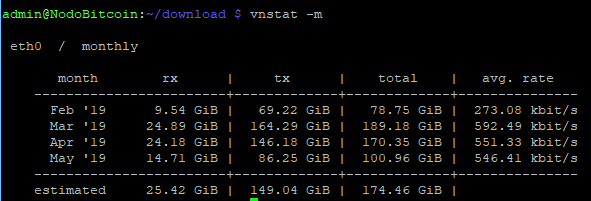

[[Introduzione](README.md)] -- [[***Perché avere un nodo Bitcoin***](01.Perchè_avere_un_nodo_Bitcoin.md)] -- [[Preparativi](02.Preparativi.md)]  -- [[Configurazione Iniziale da PC](03.Configurazione_iniziale_dell'Hardware.md)] -- [[Preparazione Software Raspberry PI](04.Configurazione_Iniziale_dell'Hardware_RaspberryPI.md )] -- [[Assemblaggio Hardware Nodo](05.Assemblaggio_Hardware_del_nodo.md)] -- [[Configurazione Software Nodo](06.Configurazione_RaspberryPi.md)] -- [[Bitcoin](07.Bitcoin.md)] -- [[Lightning](08.Lightning.md)] -- [[Mainnet](09.Mainnet.md)] -- [[Bonus](10.Bonus.md)]-- [[FAQ](099.FAQ.md)] -- [[TO DO](999.2do.md)]
 
-------

# Perché avere un proprio nodo bitcoin?
*Cui prodest tutto ciò?*

1. **Irrobustire il network Bitcoin**

I nodi sono i punti più importanti della rete Bitcoin: si occupano di verificare che tutte le transazioni, e quindi i blocchi che vengono in contatto con il nodo seguano le regole del protocollo. Gestire il proprio nodo significa quindi assicurare alla rete bitcoin un ulteriore punto di controllo sulle regole del protocollo Bitcoin: il nostro nodo inoltrerà ai nodi connessi nella rete
solamente le transazioni ed i blocchi che ne rispettino le regole. Al contempo tutto quello visto dal nostro nodo, ma al di fuori di queste regole non sarebbero inoltrato, rendendo quindi la rete intrinsecamente più resiliente: sono i nodi
che quindi in ultima istanza validano la longest proof of work chain, assicurando che alla fine siano sempre integralmente seguite le regole del protocollo.

2. **Garantire la sicurezza delle proprie transazioni: "Don’t trust, verify."**

Avere un wallet non abbinato ad un full node (SPV Wallet – Simplified Payment Verification Wallet – Wallet a verifica semplificata del pagamento) implica che per il broadcast, la verifica e la ricezione delle transazioni ci si debba per forza affidare ad un nodo esterno che ci riferisca sullo stato della blockchain, ipotizzando che questo nodo non sia malevolo , riponendo in questo quindi un elevato grado di fiducia: nel protocollo *trustless* di bitcoin questa è un’ipotesi assolutamente non necessaria, ed anzi è una caratteristica fondamentale del protocollo quella di poter verificare indipendentemente lo stato della blockchain e quindi di validare le transazioni.

3. **Garantire la privacy transazionale.**

Come abbiamo visto , usare un SPV comporta il fatto di dover usare un nodo terzo per il broadcast delle transazioni: questo permette al nodo di abbinare ad un indirizzo IP gli indirizzi bitcoin associati: la soluzione per la massima tutela della privacy delle proprie transazioni comporta quindi l’utilizzo del proprio nodo per il broadcast della propria transazione.

4. **Diritto di scelta delle regole del protocollo da validare.**

Come abbiamo visto, sono i nodi della rete a garantire l’aderenza delle transazioni contenute nei blocchi al protocollo di bitcoin. Avere il controllo di un nodo ci obbliga quindi ad avere voce in capitolo su quali regole seguire per determinare la “longest POW chain” che di fatto determina lo stato corrente delle transazioni: le nostre scelte quindi influiranno direttamente sulle transazioni e blocchi inoltrati nella rete, contribuendo alla diffusione delle regole che noi riteniamo corrette

5. **Non è costoso**

Fare il setup di un nodo bitcoin è sempre meno costoso, sia in termini di conoscenze richieste, che di hardware necessario. Guide come questa, come molte altre che si trovano in giro per la rete, permettono anche a chi ha poche conoscenze di essere up&running con il proprio nodo in breve tempo (il tempo è denaro) e senza necessità di fare riferimento a fonti diverse o avere chissà quali nozioni specifiche. D’altra parte l’hardware richiesto, come vedremo, è sempre meno costoso connessione a banda larga inclusa. Per chi non avesse voglia di intraprendere questo viaggio, sono disponibili anche delle soluzioni “chiavi in mano” pronte da essere attivate senza conoscenze e senza tempi morti. Potete consultare le [FAQ](https://github.com/Fillippone/NodoBitcoinforDummies/blob/master/099.FAQ.md#d9-questa-guida-%C3%A8-bellissima-ma-non-ho-tempo-eo-capacit%C3%A0-voglio-avere-la-vita-ancora-pi%C3%B9-semplice-cosa-mi-consigli) per avere qualche suggerimento.

# Perché NON avere un proprio nodo Bitcoin?

Così come avere un nodo Bitcoin ha indubbiamente dei vantaggi, così senz’altro vi sono degli elementi da valutare prima di decidere di avere un nodo up&running H24/7.

1.  **Limiti di Banda**

Come vedremo in seguito, se non appositamente configurato per ridurre alcune funzioni, un nodo Bitcoin può generare circa 20 GB al giorno di traffico, questo espone a notevoli costi se sul piano sono previsti limiti di utilizzo, se non addirittura delle rescissioni contrattuali per uso eccessivo. Dovrete quindi ovviamente controllare nei vostri contratti di fornitura di accesso ad internet la presenza di eventuali tetti massimi mensili e/o giornalieri ed impostare il nodo di conseguenza, seguendo le istruzioni di questa guida, i parametri di configurazione del nodo, onde scongiurare il superamento di suddetti limiti.

Dalle mie prime evidenze il traffico generato dal nodo è comunque ben inferiore al valore sopra indicato, nei primi mesi mi sono attestato attorno ai 5GB al giorno come potete vedere dall'immagine di vnstat relativa al nodo sotto riportata: 

2.  **Antivirus:**

Qualche buontempone ha inserito delle parti di codice di virus nella blockchain. Questo codice non può infettare in alcun modo il PC; ma qualche programma antivirus metterà ugualmente in quarantena i blocchi incriminati, rendendo quindi difficile tenere il nodo attivo. 

3.  **Target di attacco:**

I nodi Bitcoin alimentano il network Bitcoin, quindi in caso di attacco al network Bitcoin, chi ha un nodo attivo potrebbe esserne in qualche modo vittima designata. Le tecniche che un attaccante potrebbe usare sono molteplici, ma potrebbero risolversi in un DDoS verso il proprio IP, quindi l’impossibilità di accedere al nodo oltre che ad una riduzione della banda disponibile per la connessione.

4.  **Rischi legali**

Al momento Bitcoin e la partecipazione al network sono legali. In alcune aree del mondo avere un nodo Bitcoin potrebbe essere illegale, così come potrebbe essere regolato od in qualche modo normato. Una lista attivamente aggiornata di tale aree del mondo può essere consultata [qui](https://coin.dance/poli). Ovviamente chi volesse gestire un nodo dovrebbe quindi sottostare alle suddette norme monitorandone l’evoluzione. Altro rischio è legato al fatto che come qualche buontempone si è divertito ad inserire codice di virus informatici nella blockchain, qualche poveretto ha inserito in blockchain qualche file con contenuto  pedopornografico, scaricando la blockchain in linea puramente teorica sarebbe possibile accedere a tali immagini, con i rischi legali che ne conseguono. Non mi risulta però che nessuno sia mai stato condannato per questo, né che sia una minaccia reale dal punto di vista legale. 

---
Avanti: [2.Preparativi - Lista della spesa](02.Preparativi.md)

