[[Introduzione](README.md)] -- [[Perché avere un nodo Bitcoin](01.Perchè_avere_un_nodo_Bitcoin.md)] -- [[Preparativi](02.Preparativi.md)]  -- [[Configurazione Iniziale da PC](03.Configurazione_iniziale_dell'Hardware.md)] -- [[Preparazione Software Raspberry PI](04.Configurazione_Iniziale_dell'Hardware_RaspberryPI.md )] -- [[Assemblaggio Hardware Nodo](05.Assemblaggio_Hardware_del_nodo.md)] -- [[***Configurazione Software Nodo***](06.Configurazione_RaspberryPi.md)] -- [[Bitcoin](07.Bitcoin.md)] -- [[Lightning](08.Lightning.md)] -- [[Mainnet](09.Mainnet.md)] -- [[Bonus](10.Bonus.md)]-- [[FAQ](099.FAQ.md)] -- [[TO DO](999.2do.md)]
 
-------


# Raspberry Pi
*Configuriamo il RasPi perchè possa far girare al meglio il software Bitcoin Core*

## Scegliamo delle password
Avrete bisogno, nel proseguio di questa guida di molte password; il metodo migliore è quello di stabilirle tutte all'inizio del percorso, e poi "riciclandole" nel modo più opportuno durante il percorso. Dovrebbero essere password uniche (possiamo riutilizzare all'interno del Nodo alcune password, ma sconsiglio di usare password già utilizzate per altri scopi), e sicure: dovrebbero essere lunghe 12 caratteri ricordatevi però di **non usare caratteri speciali poco comuni e facili da confondere**, spazi o virgolette (‘ o “).
```
[ A ] Master user password
[ B ] Bitcoin RPC password
[ C ] LND wallet password
[ D ] LND seed password (optional)
```


Se avete bisogno di ispirazione per creare una nuova password potete ispirarvi alla striscia [xkcd: Password Strength](https://xkcd.com/936/). Oltre ad essere molto divertente contiene molta saggezza. Scrivete le password da qualche parte di sciuro (l'ideale sarebbe un password manager tipo KeePass o 1Password) e tenete al riparo da occhi indiscreti i vostri appunti una volta che il sistema è up and running.

Siamo finalmente pronti ad accendere per la prima volta il Raspberry Pi. Colleghiamo il nodo alla spina, il Pi si avvia!


Dagli vita, dagli vita alla mia creatura!! (Frederick Frankenstein)

## Colleghiamo il Raspberry Pi alla rete
Quando il Pi viene collegato alla rete domestica gli verrà assegnato un indirizzo dal router, questo indirizzo varierà ogni volta che il Pi si ricollega alla rete. Perché però il Pi sia raggiungibile dall'esterno in sicurezza e per rendere più facili le operazioni di amministrazione dovremo dotarlo di un indirizzo statico, ovvero dovremo obbligate il router ad assegnargli sempre il medesimo indirizzo LAN. Dovremo quindi configurare il router in tal senso.

### Accedere al Router
Dovremo quindi accedere al router per configurare l'indirizzo statico del Pi: a seconda della configurazione domestica questo potrà essere il modem di rete dell'operatore telefonico o un punto di accesso Wifi, o entrambi addirittura. Dovremo quindi prima trovare l'indirizzo di rete associato al router stesso:

* avviamo il prompt dei comandi da un computer connesso alla rete domestica (in Windows, digitate cmd direttamente in una barra di ricerca, e date Invio)
* inserite il comando `ipconfig` e poi Invio
* cercate “Default Gateway” e prendete nota dell'indirizzo(es: “192.168.0.1")

:point_right:per avere più informazioni: [come accedere al vostro router](https://www.robadainformatici.it/trovare-indirizzo-ip-router-gateway/).

Ora potete accedere al vostro router tramite il browser, digitando l'indirizzo del router medesimo come un indirizzo web qualsiasi. Probabilmente vi chiederà un'utenza di admin ed una password. 

:point_right: Se non conoscete la password del router provate [routerpasswords.com](http://www.routerpasswords.com/) :uk: .  
:warning: Se avete ancora la password di default è arrivato il momento di cambiarla!


Ora che siete collegati dovreste trovare facilmente una sezione dove siano elencati tutti i dispositivi collegati alla rete domestica. Dovrebbe essercene un chiamato “raspberrypi”, con associato il proprio indirizzo IP locale (es. “192.168.0.240” o "10.0.0.15" come nel mio caso).

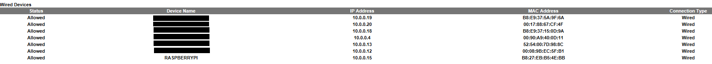


### Configuriamo l'indirizzo di rete statico

Ora dovremo fare in modo che il router assegni al Raspberry Pi un indirizzo di rete costante (IP statico). Di solito potete trovare questo settaggio sotto "DHCP server". L'indirizzo manuale dovrebbe essere il medesimo dell'indirizzo corrente, con solo l'ultima parte dell'indirizzo configurata su un numero inferiore(es: da 192.168.0.240 → 192.168.0.20, nel mio caso 10.0.0.15 è già sufficientemente basso, quindi lo fisserò a questo livello).

:point_right: Avete bisogno di maggior informazioni? Cercate ["configurare indirizzo ip statico dhcp"](https://duckduckgo.com/?q=configurare+indirizzo+ip+statico+dhcp&t=h_&ia=web) aggiungendo alla ricerca il vostro modello di Router. 

### Port Forwarding / UPnP

Ora dobbiamo fare in modo che il traffico in arrivo nella vostra rete venga indirizzato al dispositivo giusto: applicazioni differenti usano porte differenti, quindi il router deve sapere a quale dispositivo della rete domestica deve indirizzare il traffico in arrivo su una specifica porta. Per fare questo dovremo configurare correttamente il “Port Forwarding” ("Inoltro Porte" in italiano). 

Il port forwarding deve essere configurato come segue:

| Applicazione     | Porta Esterna | Porta Interna |Indirizzo IP interno | Protocollo (TCP o UDP)|
| ---------------- | ------------- | ------------- | ------------------- | --------------------- |
| bitcoin          | 8333          | 8333          | 10.0.0.15           | TCP + UDP             |
| bitcoin test     | 18333         | 18333         | 10.0.0.15           | TCP + UDP             |

:point_right: Informazioni addizionali: [configurare il port forwarding](https://www.aranzulla.it/come-aprire-le-porte-del-router-31808.html).

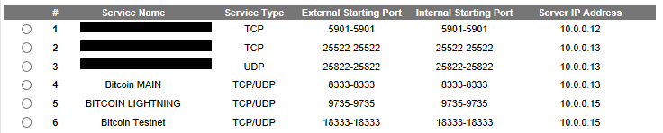

:point_right: Se volete effettuare un test della corretta apertura delle porte controllate con questo  [Test](https://ping.eu/port-chk/)

Il demone del Lightning network (LND) supporta **UPnP** per configurare il port-forwarding automaticamente e per pubblicizzare il suo IP esterno al network: dovremo quindi abilitare questo protocollo di connessione. 

* Abilitare UPnP sul router.

:point_right: Se non sapete come fare ad abilitare l'UPnP sul vostro router, cercate  ["abilitare upnp sul router"](https://duckduckgo.com/?q=abilitare+upnp+router+&t=h_&ia=web) specificando il vostro modello di Router.

Salvate ed applicate le impostazioni del router, le controlleremo in ogni modo in seguito. Scollegate il Raspberry Pi dalla corrente per qualche secondo e ricollegatelo. Il nodo dovrebbe ora avere un indirizzo IP di rete statico.

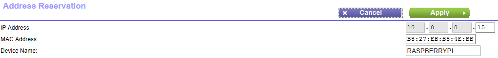

## Configuriamo il Raspberry Pi
### Introduzione alla riga di comando
Lavoreremo sulla riga di comando del Pi, che potrebbe essere una novità per voi. Meglio allora riassumere alcune informazioni di base che ci aiuteranno a muoverci all'interno del sistema operativo ed ad interagire con il Pi.

#### Inserire i comandi.
Ogni volta che inseriremo un comando il Pi risponderà stampando a schermo i risultati nelle righe sotto il comando. Per rendere più chiaro quando inizi un comando, ogni comando in questa guida inizierà con un simbolo `$`. La risposta del sistema è marcata dal simbolo`>`.

Nell'esempio seguente, inserite semplicemente `ls -la` e premete Invio:
```
$ ls -la
> example system response
```
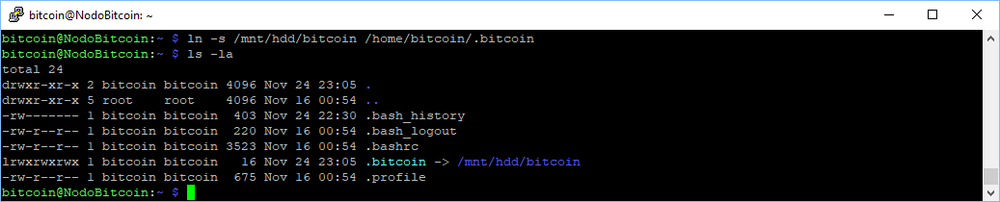

* **Auto-completamento dei comandi**: Mentre state inserendo i vostri comandi, potete usare il tasto `Tab` per l'autocompletamento per esempio di comandi, directories o nomi di file. 

* **Cronologia comandi**: premendo :arrow_up: o :arrow_down: sulla tastiera, potrete scorrere la cronologia dei comandi inseriti precedentemente. 

* **Comandi Linux comuni**: Per una lista dei principali comandi di Linux, potete fare riferimento alla pagina di [Domande Frequenti](raspibolt_faq.md).

* **Usare i privilegi di admin**: L'utente che useremo di solito non ha privilegi di admin. Se un comando ha bisogno di editare la configurazione di sistema, avremo bisogno di usare il comando `sudo` ("superuser do") come prefisso del comando da eseguire.   
Ad esempio, invece di editare un file di sistema con `nano /etc/fstab`, useremo i privilegi di admin tramite la stringa `sudo nano /etc/fstab`.   
 Per ragioni di sicurezza, l'utente "bitcoin" non sarà autorizzato ad usare il comando `sudo`.

* **Usare l'editor di testo Nano**: Useremo l'editor di testo Nano per creare e salvare nuovi file di testo o modificare e salvare file di testo esistenti. Non è affatto complicato, l'unica attenzione deve essere data al processo di salvataggio ed uscita dall'editor:  
  * Save:  `Ctrl-O` (per Output), confermate il filename, e date `Invio`.
  * Exit: hit `Ctrl-X`

* **Copia / Incolla**: Se state usando un PC windows con il client SSH Putty (vedete sotto), potrete copiare il testo dalla shell selezionandolo con il mouse (non c'è motivo di cliccare da nessuna parte); potete poi incollare quanto copiato alla posizione del cursore con un click destro  ovunque nella finestra ssh.

### Colleghiamoci al Pi
Per collegarci al Pi per configurarlo dobbiamo collegarci tramite una connessione SSH (Secure SHell). Per fare questo avremo bisogno di un apposito client:

- Windows: PuTTY ([Website](https://www.putty.org))


Installate, avviate e configurate la connessione SHH con i seguenti parametri:
  - host name: l'indirizzo statico del Pi che avrete configurato nel router, ad esempio `192.168.0.20`
  - port: `22`
  - username: `pi` 
  - password:  `raspberry`.

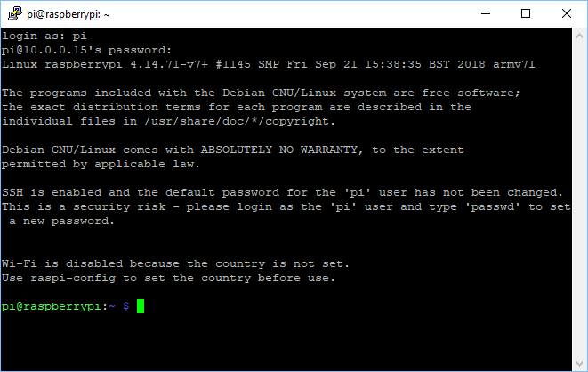

:point_right: informazioni aggiuntive: [collegarsi a l PI con SSH with Raspberry Pi](http://www.dallaf.it/simo/wp/2015/09/07/controllare-da-remoto-raspberry-pi-usando-ssh/)

### Raspi-Config
Abbiamo quindi ora accesso alla riga di comando del nostro Pi. Dobbiamo però terminarne la configurazione prima di installare ed iniziare a far funzionare il nodo. 
L'obiettivo è aumentare il grado di sicurezza del nodo ed, essendo un dispositivo collegato alla rete 24/7, diminuire la superficie di attacco per eventuali malintenzionati. 

Per prima cosa accediamo al menù di configurazione generale e modifichiamo i settaggi basilari. 

Inseriamo i seguenti comandi:

`$ sudo raspi-config`

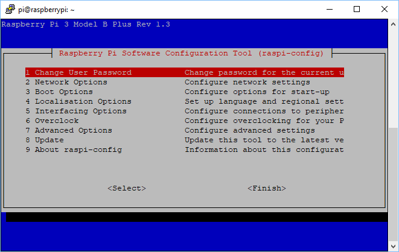

* Per prima cosa cambiamo la password di default, su `1` cambiate la password con la `password [A]` che abbiamo stabilito precedentemente. .
* Aggiorniamo il software di configurazione con `8`
* Settaggi di rete, Opzione `2`: 
  * diamo al nodo un nome (come “NodoBitcoin”, premio nome originale 2018/2019),
  * inoltre possiamo configurare la connessione Wifi (solo Pi 3), non è obbligatorio.
* Opzioni di Boot `3`: 
  * scegliete `Desktop / CLI` → `Console` e quindi
  * `Wait for network at boot`
* Localizzazione `4`: inserite il fuso orario corretto
* Avanzate  `7`: eseguite `Expand Filesystem` e configurate `Memory Split` su 16
* Uscite selezionando `<Finish>` e di seguito  `<No>` visto che non è necessario riavviare

### Software update
È importante mantenere il sistema aggiornato con le patch di sicurezza e gli aggiornamenti delle applicazioni. Per questa tediosa operazione ci viene in soccorso l' “Advanced Packaging Tool” (apt):  
`$ sudo apt-get update`  
`$ sudo apt-get upgrade`  

:point_right: sarebbe meglio effettuare questa operazione regolarmente per assicurarsi di avere installate le ultime releases e patch di sicurezza.

Assicuriamoci quindi di avere le ultime versioni di tutti i pacchetti software installati:  
  `$ sudo apt-get install htop git curl bash-completion jq dphys-swapfile`

A questo punto vedrete il Pi scaricare tutti gli ultimi pacchetti ed aggiornare le installazioni: di solito non è necessario il riavvio. 

### Aggiungere l'utente "admin"
Questa guida considera come utente principale "admin", proprio degli ambienti Linux, anziché l'utente "pi" caratteristico dei sistemi Raspberry: cerchiamo di essere più compatibile con un ambiente Linux generico.  

* Create il nuovo utente, configuriamo la password [A] ed aggiungiamolo al gruppo "sudo"  
  `$ sudo adduser admin`  
  `$ sudo adduser admin sudo` 
* Già che ci siamo, cambiamo la password dell'utente admin “root” con la solita password [A].  
  `$ sudo passwd root`
* Rebootiamo il Pi e logghiamoci con il nuovo utente "admin"  
  `$ sudo shutdown -r now`

### Aggiungiamo l'utente di servizio “bitcoin”
Per ragioni di sicurezza i processi di bitcoin e di lightning verranno eseguiti in background (come "daemon") ed useranno l'utente separato “bitcoin”. Questo utente non avrà prerogative di amministratore e non potrà cambiare le configurazioni di sistema. 


* Quando useremo il comando `sudo` , ci verrà richiesta talvolta la password di admin per aumentare il livello di sicurezza.
* Inserite il seguente comando, configurate la `password [A]` e confermate tutte le domande con il tasto Invio.  
  `$ sudo adduser bitcoin`

### Montiamo l'hard disk esterno
Per archiviare la blockchain abbiamo bisogno di un sacco di spazio. Visto che si tratta di una installazione sever, il file system nativo di linux Ext4 è la miglior scelta per l'hard disk esterno, quindi formatteremo l'ard disk, cancellando tutti i dati presenti sull'hard disk stesso. L'hard disk esterno sarà quindi aggiunto al file system e vi si potrà accedere come una normale cartella (questo è quello che si definisce "montare" un disco esterno. 

:warning: **tutti i dati presenti sull'hard disk saranno cancellati!**

* Se non lo avete ancora fatto, attaccate il disco esterno al nodo e dategli corrente (assemblaggio del nodo). 

* Troviamo il nome (NAME) della partizione principale del disco esterno  
  `$ lsblk -o UUID,NAME,FSTYPE,SIZE,LABEL,MODEL` 

* Formattiamo il disco sterno con Ext4 (usate il [NAME] trovato sopra, es `/dev/sda1`)  
  `$ sudo mkfs.ext4 /dev/[NAME]`

* Copiate l'UUID che viene fornito come risultato del comando precedente nel Notepad del Windows locale del vostro PC. 

* Editate il file fstab ed inserite la riga sotto come una nuova riga alla fine del file (sostituite `UUID=123456` con l'UUID copiato sopra)
  `$ sudo nano /etc/fstab`  
  `UUID=123456 /mnt/hdd ext4 noexec,defaults 0 0` 

* Create la directory dove montare l'hard disk e settatene il proprietario corretto

  `$ sudo mkdir /mnt/hdd`

* Montate tutti i dischi e controllate il  file system. Il folder “/mnt/hdd” è elencato? Dovrebbe esserlo!

  `$ sudo mount -a`  
  `$ df /mnt/hdd`
```
Filesystem     1K-blocks  Used Available Use% Mounted on
/dev/sda1      479667880 73756 455158568   1% /mnt/hdd
```
*  Settate il proprietario del disco  
  `$ sudo chown -R bitcoin:bitcoin /mnt/hdd/`

* Passate all'utente "bitcoin", navigate sull'hard disk e create una bitcoin directory.  
  `$ sudo su - bitcoin`  
  `$ cd /mnt/hdd`  
  `$ mkdir bitcoin`  
  `$ ls -la`

* Create un file di testo nella nuova directory e poi cancellatelo per controllare che sia tutto a posto.  
  `$ touch bitcoin/test.file`  
  `$ rm bitcoin/test.file`

* Uscite dalla sessione utente "bitcoin"   
  `$ exit` 

Se questo comando vi da un errore, allora vi sono chances che il vostro Hard Disk sia montato come “read only”. Ovviamente dovremo correggere questo errore prima di procedere. Se non ce la fate provate a ripartire da zero in quest'ultima parte e riformattare da zero l'unità.      
👉 informazioni addizionali: [external storage configuration](https://www.raspberrypi.org/documentation/configuration/external-storage.md) :uk: 

### Spostare lo Swap File

L'uso del file di swap sulla SD card può degradarne le prestazioni molto velocemente. Dovremo quindi muovere lo swap file sull'hard disk esterno.   

* Come user "admin", cancelliamo il vecchio file di swap  
  `$ sudo dphys-swapfile swapoff`  
  `$ sudo dphys-swapfile uninstall`  

* Editiamo il file di configurazione e sostituiamo le vecchie entries con quelle configurate come sotto, dopodiché salvate ed uscite.  
  `$ sudo nano /etc/dphys-swapfile`

```
CONF_SWAPFILE=/mnt/hdd/swapfile

# comment or delete the CONF_SWAPSIZE line. It will then be created dynamically 
#CONF_SWAPSIZE=
```

* Creiamo manualmente un nuovo swap file  
  `$ sudo dd if=/dev/zero of=/mnt/hdd/swapfile count=1000 bs=1MiB`  
  `$ sudo chmod 600 /mnt/hdd/swapfile`  
  `$ sudo mkswap /mnt/hdd/swapfile`  

* Abilitiamo la nuova configurazione swap  
  `$ sudo dphys-swapfile setup`  
  `$ sudo dphys-swapfile swapon`

## Irrobustiamo il Pi

I passi seguenti necessitano i privilegi di admin e devono essere eseguiti dall'utente "admin".

### Abilitiamo Uncomplicated Firewall
Il Pi sarà visibile ed accessibile da internet e dovrà quindi essere messo in sicurezza contro gli attacchi, o per lo meno dovremo rendere la vita più difficile ad un attaccante. Un firewall è un software che controlla che tipo di traffico può arrivare al nostro RaspPi e quindi chiude possibili falle di sicurezza. 

Il comando riportato sotto `ufw allow from 10.0.0.0/24…` ipotizza che l'indirizzo IP nella rete locale del vostro RaspPi sia qualcosa del tipo `10.0.0.???`, dove la parte ??? rappresenta qualsiasi numero da 0 a 255 (questo esempio ricalca la mia configurazione di rete). Se l'IP del Raspberry fosse `12.34.56.78`, allora dovreste modificare la linea in `ufw allow from 12.34.56.0/24…`.
```
$ sudo apt-get install ufw
$ sudo su
$ ufw default deny incoming
$ ufw default allow outgoing
$ ufw allow from 10.0.0.0/24 to any port 22 comment 'allow SSH from local LAN'
$ ufw allow proto udp from 10.0.0.0/24 port 1900 to any comment 'allow local LAN SSDP for UPnP discovery'
$ ufw allow 9735  comment 'allow Lightning'
$ ufw allow 8333  comment 'allow Bitcoin mainnet'
$ ufw allow 18333 comment 'allow Bitcoin testnet'
$ ufw enable
$ systemctl enable ufw
$ ufw status
$ exit
```
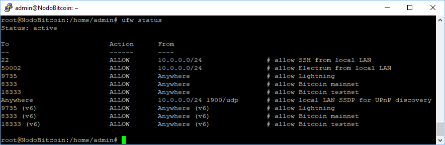

:point_right: informazioni aggiuntive: [UFW Essentials](https://www.digitalocean.com/community/tutorials/ufw-essentials-common-firewall-rules-and-commands) :gb:

:point_right: Se vi trovate chiusi fuori per errore dovrete collegarvi fisicamente con uno schermo ed una tastiera al Pi e fare un login da locale per correggere le impostazioni (in particolare per la porta SSH 22).

### fail2ban
Dobbiamo proteggere in tutti i modi il login via SSH del Pi. Il firewall dovrebbe bloccare tutti i tentativi di login al di fuori del network, ma step addizionali dovrebbero essere presi per prevenire la possibilità che un attaccante, magari dall'interno della vostra rete, semplicemente provi tutte le possibili password (brute force attack - attacco con forza bruta).

La prima contromisura è quella di installare “fail2ban”, un servizio che impedisce ogni tentativo di accesso al sistema per dieci minuti dopo 5 tentativi di login non riusciti. Lo scopo di questo time out è proprio quello di penalizzare i tentativi a vuoto, rendendo quindi di fatto non praticabile i tentativi basati sulla forza bruta.

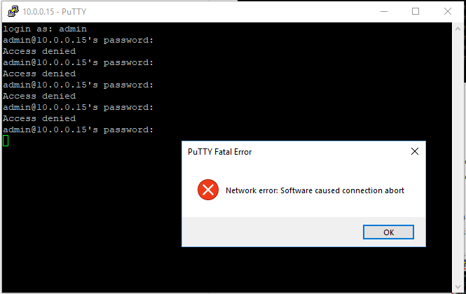


*Oops ho sbagliato la password 5 volte* :wink:

`$ sudo apt-get install fail2ban`

La configurazione iniziale è assolutamente ok, non è necessario toccare nulla. Se proprio volete addentravi nei dettagli potete consultare il seguente link: :point_right: [settare la configurazione di fail2ban ](https://linode.com/docs/security/using-fail2ban-for-security/) :gb:.

### Login con le chiavi di sicurezza SSH

Uno dei modi più robusti per rendere sicro il login in SSH è quello di disabilitare completamente la passrod e di richiedere per il login un certificato SSH. Solo gli utenti con il possesso fisico del certificato potranno quindi effettuare il login.

* Configuriamo le chiavi di accesso SSH per l'utenza "admin":
seguite questa semplice guida, in inglese  [Configure “No Password SSH Keys Authentication” with PuTTY on Linux Servers](https://www.tecmint.com/ssh-passwordless-login-with-putty) :GB:

Ora dovreste aver generato tre files. Teneteli al sicuro, ora andremo a disabilitare il login tramite password.

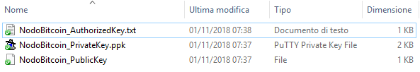

* UScite dal sistema (`exit`) ed effettuate dei test per essere sicuri che riusciate a collegarvi con l'utenza "admin" con le vostre chiavi SSH.

* Editiamo il file di configurazione SSH  
`$ sudo nano /etc/ssh/sshd_config`

* Cambiamo i settaggi "ChallengeResponseAuthentication" e "PasswordAuthentication" a "no" (scommentate le linee rimuovendo il simbolo # se necessario)  

  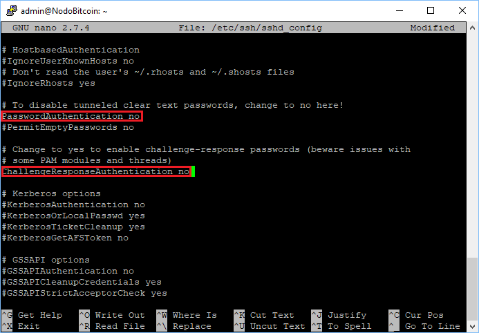

* Salvate la configurazione ed uscite 
CTRL+O
CTRL+Z  

* Copiate la chiave SSH pubblica per l'utenza "root", per prudenza.
  `$ sudo mkdir /root/.ssh`  
  `$ sudo cp /home/admin/.ssh/authorized_keys /root/.ssh/`  
  `$ sudo chown -R root:root /root/.ssh/`  
  `$ sudo chmod -R 700 /root/.ssh/`  
  `$ sudo systemctl restart ssh`  

* UScite e riloggatevi nuovamente. Ora non potrete più loggarvi con le utenze "pi" o "bitcoin", potrete usare solo "admin" e "root" che sono gli unici ad avere le necessari chiavi SSH.  
  `$ exit`

:warning: **Fate un backup sicuro delle vostre chiavi SSH!** Avrete bisogno di attaccare  uno schermo ed una tastiera al vostro RasPi se le perdete.

### Aumentate il vostro limite di file aperti
Nel caso il vostro Raspi sia travolto da una moltitudine di connessioni internet (oneste o financo malevole come nel caso di un attacco DdOS, voi incontrete rapidamente l'errore `can't accept connection: too many open files`. Questo è dovuto al limite dei file aperti (che non sono altro che singole connessioni tcp) che è settato come troppo basso. 

Editate i seguenti tre files, aggiungete le linee addizionali appena prima del commento finale, dopodiché salvate ed uscite.

```
$ sudo nano /etc/security/limits.conf
*    soft nofile 128000
*    hard nofile 128000
root soft nofile 128000
root hard nofile 128000
```


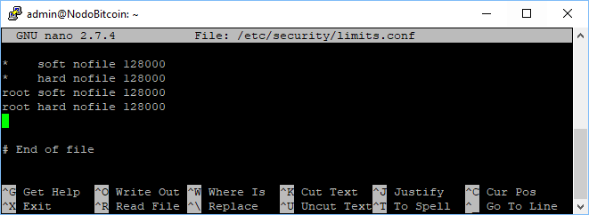


```
$ sudo nano /etc/pam.d/common-session
session required pam_limits.so
```


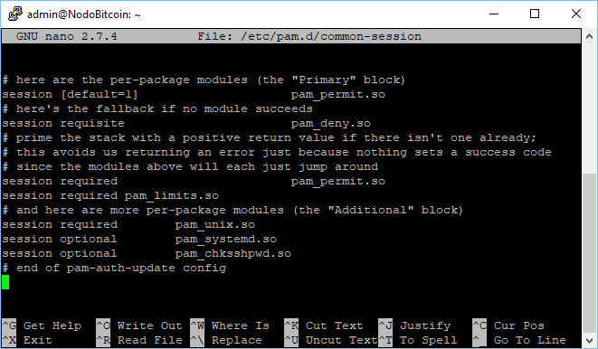


```
$ sudo nano /etc/pam.d/common-session-noninteractive
session required pam_limits.so
```

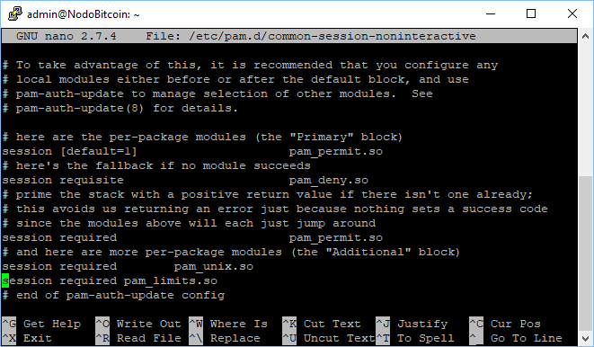


---
Avanti: [7.Installiamo il software bitcoin](07.Bitcoin.md)
