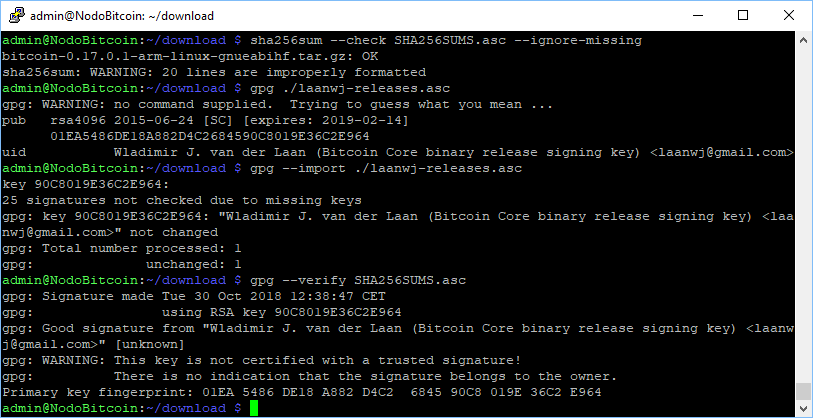
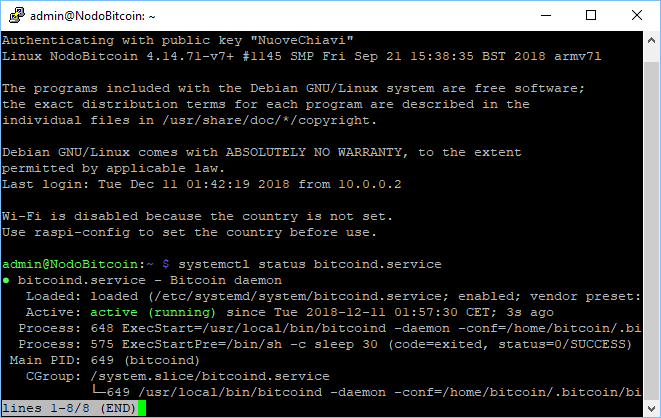
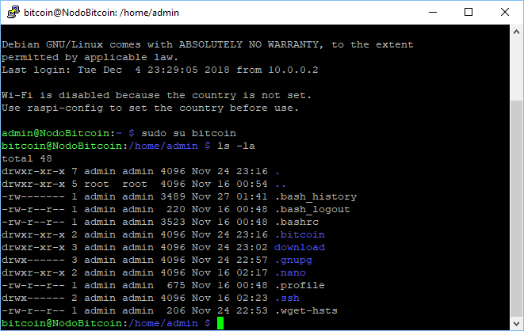
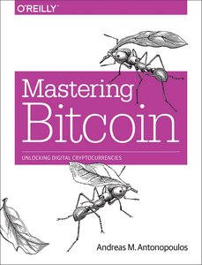

[ [Introduzione](README.md) ] -- [ [Perché avere un nodo Bitcoin](01.Perchè_avere_un_nodo_Bitcoin.md) ] -- [ [Preparativi](02.Preparativi.md) ]  -- [ [Hardware](03.Configurazione_iniziale_dell'Hardware.md) ] -- [ [Raspberry PI](04.Configurazione_Iniziale_dell'Hardware_RaspberryPI.md ) ] -- [ [HW Nodo](05.Assemblaggio_Hardware_del_nodo.md) ] -- [ [SW Nodo](06.Configurazione_RaspberryPi.md) ] -- [***Bitcoin***] -- [ [Lightning](08.Lightning.md) ] -- [ [FAQ](099.FAQ.md) ] -- [ [TO DO](999.2DO.md) ]

---


### Installazione
*Installiamo Bitcoin e Lightning. Iniziamo da Bitcoin testnet*


Lightning per funzionare ha bisogno di un nodo [Bitcoin Core](https://bitcoin.org/en/bitcoin-core/). Come abbiamo visto un nodo Bitcoin ha la copia completa della blockchain e valida tutte le transazioni ed i blocchi che vede in maniera trustless. Facendo tutto questo lavoro da soli, non abbiamo bisogno di avere fiducia in nessuno, quindi abbiamo tutto l'incentivo ad essere cittadini di serie A della rete bitcoin ed avere il nostro full node. 

Per iniziare installeremo sia Bitcoin che Lightning in ambiente di test, in modo da impratichirci con le operazioni di base senza metter a rischio i nostri preziosi fondi.
In questa fase non avremo bisogno ancora della blockchain di Bitcoin, che andremo a copiare sul Raspi solamente quando vorremo passare sulla rete di produzione (mainnet). Tutto il processo di sincronizzazione sarà fatto dal Raspberry, ci vorrà qualche ora, ma è gestibile, diciamo nel corso di una nottata. 
Se non siete interessati a lightning, passate oltre nella configurazione, il percorso riguarderà solamente bitcoin, ma consiglio comunque il passsaggio in testnet prima di avventurarci nella vera rete bitcooin. 


### Download ed installazione di Bitcoin Core
Scaricheremo il softare direttamente da bitcoin.org, ne verificheremo la firma per assicurarci di unare una versione ufficiale e non corrotta e la installleremo sul nodo. Già che ci siamo, verificheremo inoltre la firma del programma che abbiamo usato per scaricare la blockchain sul pc ausiliario.

* Accedete come "admin" e create una cartella di downloadr  
  `$ mkdir /home/admin/download`  
  `$ cd /home/admin/download`   
* Se state upgradando la versione ed avete dei file scaricati, prima di tutto cancellateli  
  `$ rm * `

Scaricheremo l'ultima versione dei binari di Bitcoin Core (l'applicazionehe) e verificheremo l'hash del file scaricato con la firma del file originale. Questaè una precauzione necessatia per essere sicuri che sia una release ufficiale e non una versione modificata, in modo malevolo, che possa mettere a rischio i nostri fondi.

* Procuratevi i link di download dell'ultima versione sul sito di Bitcoin Core [bitcoincore.org/en/download](https://bitcoincore.org/en/download) versione (ARM Linux 32 bit), cambiano ad ogni versione. Eseguite quindi i seguenti comandi, modificando come necessario i nomi dei file, e controllate l'output a video:

  `$ wget https://bitcoincore.org/bin/bitcoin-core-0.17.0.1/bitcoin-0.17.0.1-arm-linux-gnueabihf.tar.gz`  
  `$ wget https://bitcoincore.org/bin/bitcoin-core-0.17.0.1/SHA256SUMS.asc`  
  `$ wget https://bitcoin.org/laanwj-releases.asc`

* Controlliamo che la checksum del file scaricato sia la medesima del file di riferimento: 

  `$ sha256sum --check SHA256SUMS.asc --ignore-missing`  
  `> bitcoin-0.17.0.1-arm-linux-gnueabihf.tar.gz: OK`

* Controlliamo a mano la firma della chiave pubblica:  
  `$ gpg ./laanwj-releases.asc`  
  `> 01EA5486DE18A882D4C2684590C8019E36C2E964`

* Importate quindi la chiave pubblica di Wladimir van der Laan, verificate il file firmato contenente tutte le checksum e controllate ancora l'imporonta in caso di chiave malevoli:  

  `$ gpg --import ./laanwj-releases.asc`  
  `$ gpg --verify SHA256SUMS.asc`  
  `> gpg: Good signature from Wladimir ...`  
  `> Primary key fingerprint: 01EA 5486 DE18 A882 D4C2  6845 90C8 019E 36C2 E964`  



* ora che sappiamo che le chiavi da bitcoin.org sono validwe, possiamo anceh verificare i checksum dei binari di Windows. Confrontate l'output che segue con il checksum del vostro file di donwload di Bitcoin Core per Windows. 

  `$ cat SHA256SUMS.asc | grep win` 
```
400c88eae33df6a0754972294769741dce97a706dc22d1438f8091d7647d5506  bitcoin-0.17.0.1-win32-setup.exe
221ae5af9e029623fd4b3971966cb51d3c91dc1425bcb6d2899b1d7292a91691  bitcoin-0.17.0.1-win32.zip
a624de6c915871fed12cbe829d54474e3c8a1503b6d703ba168d32d3dd8ac0d3  bitcoin-0.17.0.1-win64-setup.exe
2d0a0aafe5a963beb965b7645f70f973a17f4fa4ddf245b61d532f2a58449f3e  bitcoin-0.17.0.1-win64.zip
```
* Estraete i binari di Bitcoin Core, installateli e controllate la versione.  

  `$ tar -xvf bitcoin-0.17.0.1-arm-linux-gnueabihf.tar.gz`  
  `$ sudo install -m 0755 -o root -g root -t /usr/local/bin bitcoin-0.17.0/bin/*`  
  `$ bitcoind --version`  
  `> Bitcoin Core Daemon version v0.17.0`

### Prepariamo la directory per Bitcoin Core

Il nodo Bitcoin userà il demone Bitcoin, chiamato bitcoind, che scriverà tutti i dati nella directory  `/home/bitcoin/.bitcoin`. Invece di creare una vera directory sulla scheda SD, creiamo un link che punta alla directory sull'hard disk esterno. 

:point_right:  :raising_hand: Nel mondo Linux un "demone", *daemon* in inglese, è un programma eseguito in background, cioè senza che sia sotto il controllo diretto dell'utente, senza interfaccia e che tipicamente fornisce un servizio all'utente. Di solito i demoni hanno nomi che finiscono per "d"  :point_left:

* Mentre siamo loggati come utente "admin", cambiamo l'utente in “bitcoin”  
  `$ sudo su - bitcoin`

* Aggiungiamo il link simbolico che punta al disco esterno.  
  `$ ln -s /mnt/hdd/bitcoin /home/bitcoin/.bitcoin`

* Navighiamo nella home directory e controlliamo il link simbolico che abbiamo appena creato (la destinazione non deve esssere di colore rosso). Il contenuto di questa directory è in effetti sull'hard disk esterno. 

  `$ ls -la`



### Configurazione di bitcoind

Ora andremo a creare il file di configurazione di bitcoind. Copiate la configurazione riportate di seguito, aprite Nano ed incollatela. 


`$ nano /home/bitcoin/.bitcoin/bitcoin.conf`

```bash
# NodoBitcoin: bitcoind configuration
# /home/bitcoin/.bitcoin/bitcoin.conf

# Rimuovete (Commentate) la linea di seguito per passare da testnewt a mainnet
testnet=1

# Opzioni Bitcoind
server=1
daemon=1
txindex=1

# Impostazioni di connessione
rpcuser=NodoBitcoin
rpcpassword=PASSWORD_[B]

onlynet=ipv4
zmqpubrawblock=tcp://127.0.0.1:28332
zmqpubrawtx=tcp://127.0.0.1:28333

# Ottimizzazioni per RaspberryPi 
dbcache=100
maxorphantx=10
maxmempool=50
maxconnections=40
maxuploadtarget=5000
```

:warning: Sostituite la password `rpcpassword` con la vostra  `password [B]`, altrimenti i vostri fondi saranno a rischio furto.

Salvate ed uscite. 

`CTRL + O

CTRL + X`


:point_right: Se volete approfondire potete consultare la voce sulle [opzioni di configurazione ](https://en.bitcoin.it/wiki/Running_Bitcoin#Command-line_arguments) :gb: su Bitcoin Wiki

### Avviate bitcoind

Mentre siete ancora loggati come l'utente "bitcoin", avviate "bitcoind" manualmente. Monitorate il file di log per qualche minuto per controllare che tutto vada bene (potrebbe interrrompersi su "dnsseed thread exit", ma va bene). 
UScite dal file di log con `Ctrl-C`, controllate le informazioni sulla blockchain e, se non ci sono errori, stoppate ancora bitcoind.


```
$ bitcoind
$ tail -f /home/bitcoin/.bitcoin/testnet3/debug.log
$ bitcoin-cli getblockchaininfo
$ bitcoin-cli stop
```

### Avvio automatico di bitcoind

Per poter funzionare il nodo ha bisogno che il demone bitcoind sia avviato automaticamente in background, anche senza che nessun utente sia loggato.  Per fare questo abbiamo bisogno di un altro demone “systemd“, che controlla il processo di startup usando dei file di configurazione.

* Uscite dalla sessione utente “bitcoin” per tornare nella sessione utente “admin”  
  `$ exit`

* Create il file di configurazione nell'editor di testo Nano 

  `$ sudo nano /etc/systemd/system/bitcoind.service`

copiate il codice seguente:

```bash
# NodoBitcoin: systemd unit for bitcoind
# /etc/systemd/system/bitcoind.service

[Unit]
Description=Bitcoin daemon
After=network.target

[Service]
ExecStartPre=/bin/sh -c 'sleep 30'
ExecStart=/usr/local/bin/bitcoind -daemon -conf=/home/bitcoin/.bitcoin/bitcoin.conf -pid=/home/bitcoin/.bitcoin/bitcoind.pid
PIDFile=/home/bitcoin/.bitcoin/bitcoind.pid
User=bitcoin
Group=bitcoin
Type=forking
KillMode=process
Restart=always
TimeoutSec=120
RestartSec=30

[Install]
WantedBy=multi-user.target
```
* Salvate ed uscite 

`CRTL + O

 CRTL + X


* Abilitate il file di configurazione   
  `$ sudo systemctl enable bitcoind.service`
* Copiate `bitcoin.conf` nella home directory dell'utente "admin" per abilitare le credenziali RPC 
  `$ mkdir /home/admin/.bitcoin`   
  `$ sudo cp /home/bitcoin/.bitcoin/bitcoin.conf /home/admin/.bitcoin/` 
* Riavviate il Raspberry Pi  
  `$ sudo shutdown -r now`

### Verifica della funzionalità di bitcoind
Dopo aver riavviato, il demone bitcoind dovrebbe iniziare a scaricare e validare la Bitcoin blockchain.

* Aspettate qualche minut0, ricollegatevi via SSH e fate login con l'utenza “admin”.

* Controllate lo status del demone bitcoind che è stato a sua volta avviato dal demone systemd

  `$ systemctl status bitcoind.service`

 (potete uscire con `Ctrl-C`) 
 


* Potete esaminare bitcoind in azione monitorando il suo file di log 
  `$ sudo tail -f /home/bitcoin/.bitcoin/testnet3/debug.log`
  
(exit with `Ctrl-C`)  

* Usate il client Bitcoin Core `bitcoin-cli` per avere informazioni sulla blockchain che state usando (testnet o mainnet che sia)

  `$ bitcoin-cli getblockchaininfo`

* Attenzione:
  * Mentre “bitcoind” si sta ancora avviando, potreste avere un messaggio di errore del tipo “verifying blocks”. e' normale, ci vuole qualche minuto perchè il demone verifichi i blocchi appena scaricati. 
  * Tra le altre informazioni, è mostrata anche “verificationprogress”. Una volta che questo valore raggiunge valori prossimi ad 1( es: 0.999…), la blockchain è asggiornata e valòidata.

### Vi presento la bitcoin-cli
Se tutto va bene, allora siamo live sulla testnet. Questo è il momento migliore per familiarizzare con il client Bitcoin Core e giocare con la `bitcoin-cli` mentre attendiamo che la blockchain sia interamente scaricata ed aggiornata.

* Un ottimo punto di partenza è i libro **Mastering Bitcoin** di Andreas Antonopoulos @aantonop - pubblicato sotto licenza open source. In particolare ci interessa il capitolo 3 (ignorate la prima parte su come compilare dal codice sorgente):
  * :pray: Sarebbe obbligatorio avere una [copia fisica ](https://bitcoinbook.info/) di questo libro!
  * Se proprio non ce la fate, potete trovarlo online su [Github](https://github.com/bitcoinbook/bitcoinbook)



* Per i più audaci ed esperti di Linux e linguaggi di programmazione [**Learning Bitcoin from the Command Line**](https://github.com/ChristopherA/Learning-Bitcoin-from-the-Command-Line/blob/master/README.md) di Christopher Allen.


:point_right: Ulteriori informazioni: [bitcoin-cli reference](https://en.bitcoin.it/wiki/Original_Bitcoin_client/API_calls_list) :gb:

Una volta che abbiamo scaricato e verificato la blockchain su Testnet, possiamo dedicarci al settaggio del nodo Lightning. 

-----

### Upgrade del software Bitcoin Core
Se vorrete in futuro aggiornare la versione di Bitcoin Core ad una nuova release, controllate le FAQ:  
[COme aggiornare Bitcoin Core](099faq.md#Come-Aggiornare-BItcoin-Core)

-----
Next: [Lightning](08.Lightning.md)
