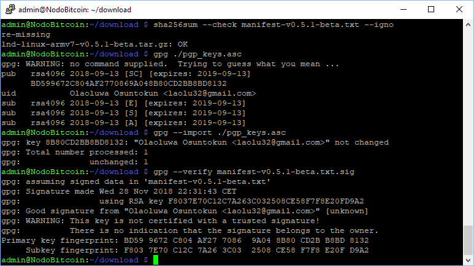
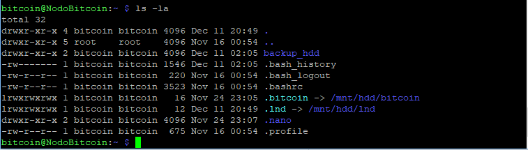
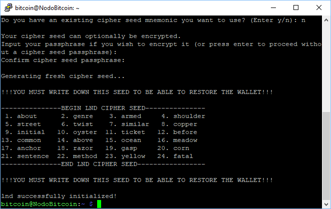
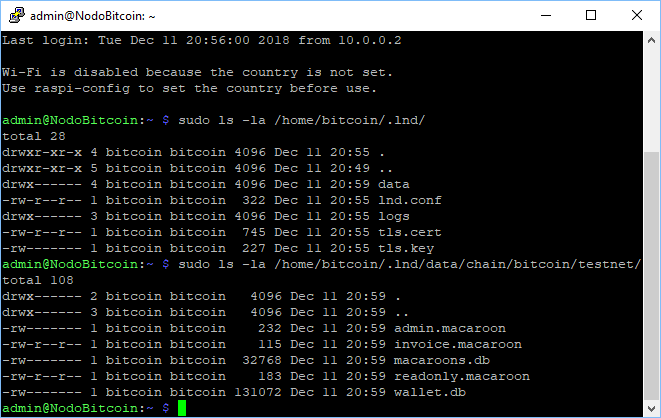

[[Introduzione](README.md)] -- [[Perché avere un nodo Bitcoin](01.Perchè_avere_un_nodo_Bitcoin.md)] -- [[Preparativi](02.Preparativi.md)]  -- [[Hardware](03.Configurazione_iniziale_dell'Hardware.md)] -- [[Raspberry PI](04.Configurazione_Iniziale_dell'Hardware_RaspberryPI.md )] -- [[HW Nodo](05.Assemblaggio_Hardware_del_nodo.md)] -- [[SW Nodo](06.Configurazione_RaspberryPi.md)] -- [[Bitcoin](07.Bitcoin.md)] -- ***[Lightning]*** -- [[FAQ](099.FAQ.md)] -- [[TO DO](999.2do.md)]

# Lightning: LND
*Attivato il nodo bitcoin, attiviamo il nodo Lightning Network*


Scaricheremo ed installeremo il LND (Lightning Network Daemon) by [Lightning Labs](http://lightning.engineering/). Potete trovare tutta la documentazione relativa sul protocollo Lightning in generale e sulla loro specifica implementazione open source sul loro [repository Github](https://github.com/lightningnetwork/lnd/blob/master/README.md) :gb: .

Scarichiamo, verifichiamo le firme, ed installiamo il software dal GitHub ufficiale. 
Olaoluwa Osuntokun @roasbeef è il CTO di Lightning Labs

```
$ cd /home/admin/download
$ rm *
$ wget https://github.com/lightningnetwork/lnd/releases/download/v0.5.1-beta/lnd-linux-armv7-v0.5.1-beta.tar.gz
$ wget https://github.com/lightningnetwork/lnd/releases/download/v0.5.1-beta/manifest-v0.5.1-beta.txt
$ wget https://github.com/lightningnetwork/lnd/releases/download/v0.5.1-beta/manifest-v0.5.1-beta.txt.sig
$ wget https://keybase.io/roasbeef/pgp_keys.asc

$ sha256sum --check manifest-v0.5.1-beta.txt --ignore-missing
> lnd-linux-armv7-v0.5-beta.tar.gz: OK

$ gpg ./pgp_keys.asc
> BD599672C804AF2770869A048B80CD2BB8BD8132

$ gpg --import ./pgp_keys.asc
$ gpg --verify manifest-v0.5.1-beta.txt.sig
> gpg: Good signature from "Olaoluwa Osuntokun <laolu32@gmail.com>" [unknown]
> Primary key fingerprint: BD59 9672 C804 AF27 7086  9A04 8B80 CD2B B8BD 8132
>      Subkey fingerprint: F803 7E70 C12C 7A26 3C03  2508 CE58 F7F8 E20F D9A2

$ tar -xzf lnd-linux-armv7-v0.5.1-beta.tar.gz
$ sudo install -m 0755 -o root -g root -t /usr/local/bin lnd-linux-armv7-v0.5.1-beta/*
$ lnd --version
> lnd version 0.5.1-beta commit=3b2c807288b1b7f40d609533c1e96a510ac5fa6d
```


### Configurazione di LND
Ora che LND è installato, dobbiamo prima di tutto configurarlo per poter funzionare con Bitcoin Core e successivamente abilitarne l'avvio automatico in fase di startup.

* Aprite una sessione utente "bitcoin"  
  `$ sudo su - bitcoin` 

* Create la directory di lavoro per LND ed il corrispondente link simbolico  
  `$ mkdir /mnt/hdd/lnd`  
  `$ ln -s /mnt/hdd/lnd /home/bitcoin/.lnd`  
  `$ ls -la`



* Create il file di configurazione LND ed incollate il codice seguente (cambiatelo nella parte rilevante per adattarlo al vostro alias).

Salvate ed uscite.  


  `$ nano /home/bitcoin/.lnd/lnd.conf`

```bash
# Nodobitcoin: lnd configuration
# /home/bitcoin/.lnd/lnd.conf

[Application Options]
debuglevel=info
maxpendingchannels=5
alias=YOUR_NAME [LND]
color=#68F442
nat=true

[Bitcoin]
bitcoin.active=1

# Abilitate la testnet o la mainnet di bitcoin
bitcoin.testnet=1
#bitcoin.mainnet=1

bitcoin.node=bitcoind

[autopilot]
autopilot.active=1
autopilot.maxchannels=5
autopilot.allocation=0.6
```
:point_right: Informazioni supplementari: [sample-lnd.conf](https://github.com/lightningnetwork/lnd/blob/master/sample-lnd.conf) nel repository del progetto LND :gb: 

### Avviate LND

Come per la parte Bitcoin, prima avviamo il progamma manualmente con l'utente "bitcoin" per controllare che tutto funzioni correttamente.

`$ lnd`

Il demone LN stampa le proprie informazioni di status direttamente nella linea di comando. Questo significa che non possiamo usare questa sessione senza fermare il server. Dobbiamo quindi aprire una seconda sessione SSH.


### Setup del wallet LND

Avviate il vostro programma SSH (es. PuTTY) una seconda volta, connettetevi al Pi e loggatevi come "admin". I comandi per la **seconda sessione** saranno evidenziati con `$2` (che non dovrete inserire nella riga di comando, naturalmente).

Una volta che LND si è avviato, il processo aspetta che venga creato il portafoglio Bitcoin integrato (non userà difatti il portafoglio del demone "bitcoind"). 

* Avviate una sessione utente "bitcoin" (dalla seconda sessione quindi)   
  `$2 sudo su - bitcoin`

* Create il wallet LND  

  `$2 lncli --network=testnet create` 

* Se volete creare un nuovo wallet, inserite la vostra `password [C]` come password del portafoglio e selezionate `n`  come risposta alla domanda riguardo al seed, in quanto non lo avete e volete crearne uno nuovo, ed infine  inserite la password opzionale `password [D]` come password per generare il nuovo seed. Questo creerà un nuovo seed da 24 parole.



Queste 24 parole, assieme alla vostra password (la password opzionale `password [D]`) è tutto ciò di cui avrete bisogno in caso dobbiate recuperare il vostro portafoglio Bitcoin e tutti i canali Lighting. Lo stato attuale dei canali, invece, non potrà essere ricreato da questo seed: questo richiede un backup continuo ed è ancora in sviluppo da parte di LND.

:warning: La passphrase deve essere tenuta segreta! **Scrivete queste 24 parole su un pezzo di carta e conservatele in un luogo sicuro.** Questo pezzo di carta è tutto ciò che serve ad un agente malevolo a sottrarvi i vostri fondi! Non conservatelo in chiaro su un computer, non fate una foto con il vostro telefonino. **Questa stringa di parole non dovrebbe mai essere conservata da nessuna parte in modo digitale.** Applicate in pratica tutte le cure che applicate per la conserevazione del seed del vostro portafoglio Bitcoin principale

* Uscite dalla sessione utente "bitcoin"   
  `$2 exit`

Autorizziamo l'utente "admin" a lavorare con LND usando l'interfaccia a riga di comando `lncli`. Per far si che questo funzioni, dobbiamo copiare il certificato del Transport Layer Security (TLS- Sicurezza dello Strato di Trasporto) ed i file di permesso (macaroons) nella directory home dell'utente "admin".

* Controllate che i certificati TLS siano stati creati  
  `$2 sudo ls -la /home/bitcoin/.lnd/`

* Controllate che i file di permesso `admin.macaroon` e `readonly.macaroon` siano stati creati.  
  `$2 sudo ls -la /home/bitcoin/.lnd/data/chain/bitcoin/testnet/`



* Copiate i macaroons ed il certificato TLS nella directory home di "admin"   
  `$2 cd /home/bitcoin/`  
  `$2 sudo cp --parents .lnd/data/chain/bitcoin/testnet/admin.macaroon /home/admin/`  
  `$2 sudo cp /home/bitcoin/.lnd/tls.cert /home/admin/.lnd`  
  `$2 sudo chown -R admin:admin /home/admin/.lnd/`  
  
* Assicuratevi che l'interfaccia da riga di comando `lncli` funziioni sbloccando il portafoglio (utilizzate la vostra `password [C]` ) e interrogando il nodo su alcune informazioni di base.   
  `$2 lncli --network=testnet unlock`
* controllato lo stato corrente del nodo LND 
  `$2 lncli --network=testnet getinfo`

Potete anche vedere il progresso della sincronizzazione iniziale di LND con Bitcoin nella prima sessione SSH. 

Controllate che nel dump a schermo siano presenti le seguenti linee per assicurarvi che il port forwarding abbia avuto successo con UPnP. Se LND non riesca a configurare il router(nel caso quest'ultimo non supporti UPnP, per esempio), il nodo funzionerà ugualmente, ma non sarè in grado di effettuare il routing di transazioni di altri partecipanti al network. 

```
[INF] SRVR: Scanning local network for a UPnP enabled device
[INF] SRVR: Automatically set up port forwarding using UPnP to advertise external IP
```

Fermiamo un attimo il server e tornaimo ad occuparci della prima sessione SSH.

* `$2 lncli --network=testnet stop`
* `$2 exit`

Questo arresterà LND in modo corretto nella prima sessione SSH, in modo che questa possa essere nuovamente utilizzata.

### Autostart di LND

Impostiamo LND in modo che parta automaticamente con lo stertup del sistema.

* Uscite dalla sessione utente "bitcoin" per tornare ad "admin"  

  `$ exit`
* Create un file di configurazione per il demone LND systemd con il seguente contenuto

  `$ sudo nano /etc/systemd/system/lnd.service` 

```bash
# RaspiBolt: systemd unit for lnd
# /etc/systemd/system/lnd.service

[Unit]
Description=LND Lightning Daemon
Wants=bitcoind.service
After=bitcoind.service

[Service]
ExecStart=/usr/local/bin/lnd

User=bitcoin
Group=bitcoin
Type=simple
KillMode=process
LimitNOFILE=128000
TimeoutSec=240
Restart=always
RestartSec=60

[Install]
WantedBy=multi-user.target
```

Salvate ed uscite.

`Ctrl - O`

`Crtl - X`


* Abilitate ed avviate LND  
  `$ sudo systemctl enable lnd`  
  `$ sudo systemctl start lnd`  
  `$ systemctl status lnd`  

* Ora il demone non mostrarà più le informazioni a schermo sulla linea di comando, ma sono registrrate nel registro di sistema. You can monitor the LND startup progress until it caught up with the testnet blockchain (about 1.3m blocks at the moment). This can take up to 2 hours, after that you see a lot of very fast chatter (exit with `Ctrl-C`).  
  `$ sudo journalctl -f -u lnd`


### Otteniamo qualche Bitcoin Testnet

Ora è tutto pronto, Bitcoin Core e nodo Lightning Network. Possiamo quindi iniziare ad impratichirci. Per fare questo avremo bisogno di Bitcoin sulla rete testnet: possiamo averli da un *faucet* (letteralmente: "rubinetto")


* Generate un indirizzo Bitcoin aper ricevere fondi sulla blockchain

  `$ lncli --network=testnet newaddress np2wkh`  
  `> "address": "2NCoq9q7............dkuca5LzPXnJ9NQ"` 

* Mandate dei Bitcoin di Testnet al vostro indirizzo:  
  https://testnet-faucet.mempool.co

* Controllate il saldo del vostrto wallet LND  
  `$ lncli --network=testnet walletbalance`  

* Monitorate le vostre transazioni (il *faucet* mostra l' identificativo dellla transazione, TX ID) su un Blockchain explorer:  
  https://testnet.smartbit.com.au

### LND in action
Non appena la vostra transazione per alimentare il nodo bitcoin è stata confermata, LND inizierà ad aprire e mantenere i canali. Questa feature è chiamata "Autopilot" ed è configurata nel file "lnd.conf". Se volete mantenee i canali in modalità manuale, disabilitate autopilot. I

Procuratevi una richiesta di pagamento su [StarBlocks](https://starblocks.acinq.co/#/) o [Y’alls](https://yalls.org/) e muovete qualche bitcoin!

* `$ lncli --network=testnet listpeers`  
* `$ lncli --network=testnet listchannels`  
* `$ lncli --network=testnet sendpayment --pay_req=lntb32u1pdg7p...y0gtw6qtq0gcpk50kww`  
* `$ lncli --network=testnet listpayments`  

:point_right: visitate il sito  [Lightning API reference](http://api.lightning.community/) :gb: per tutte le informazioni di dettaglio

-----

### Upgrade LND

Se vorrete upgradare ad una nuova release di LND in futuro, controllate la sezione dedicata alle FAQ: 
If you want to upgrade to a new release of LND in the future, check out the FAQ section:  
[How to upgrade LND](https://github.com/Fillippone/NodoBitcoinforDummies/blob/master/099.FAQ.md#d7-come-aggiorno-lnd)

-----

### Prima di procedere alla mainnet 
Questo è il punto di non ritorno. Fino ad ora si poteva benissimo ri iniziare dall'inizio. Fate eseprimenti con i bitcoin di testnet, aprite e chiudete canali sulla testnet.
Una volta che passate sulla mainnet e manderete veri bitcoin con il vostro "nodo bitcoin", allora avrete la "Skin in the game"  - "interessi in gioco")


* Assicuratevi che il vostro RasPi funzioni come atteso.
* Fate un pò di pratica con la `bitcoin-cli` e le relative opzioni (controllate [Bitcoin Core RPC documentation](https://bitcoin-rpc.github.io/))
* Fate un dry run cpon la `lncli` e le sue molte opzioni (see [Lightning API reference](http://api.lightning.community/))
* Provate a fare qualche restart (`sudo shutdown -r now`): funziona tutto come vi sareste aspettati?

Se sì, possiamo andare avanti

---
Next: [Mainnet >>](raspibolt_50_mainnet.md)
