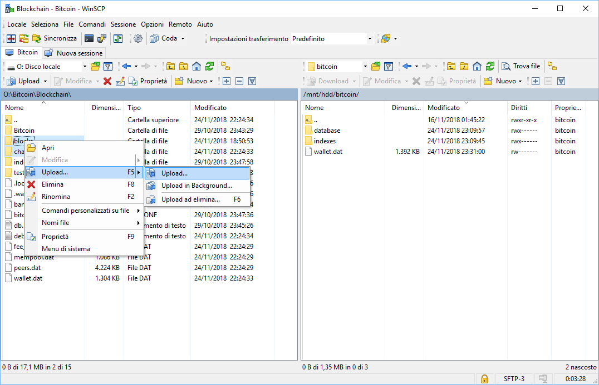

[[Introduzione](README.md)] -- [[Perché avere un nodo Bitcoin](01.Perchè_avere_un_nodo_Bitcoin.md)] -- [[Preparativi](02.Preparativi.md)]  -- [[Configurazione Iniziale da PC](03.Configurazione_iniziale_dell'Hardware.md)] -- [[Preparazione Software Raspberry PI](04.Configurazione_Iniziale_dell'Hardware_RaspberryPI.md )] -- [[Assemblaggio Hardware Nodo](05.Assemblaggio_Hardware_del_nodo.md)] -- [[Configurazione Software Nodo](06.Configurazione_RaspberryPi.md)] -- [[Bitcoin](07.Bitcoin.md)] -- [[Lightning](08.Lightning.md)] -- [[***Mainnet***](09.Mainnet.md)] -- [[Bonus](10.Bonus.md)]-- [[FAQ](099.FAQ.md)] -- [[TO DO](999.2do.md)]
 
-------


# Mainnet

*E' giunto il momento di levare i braccioli e buttarsi nella piscina dei grandi* 


⚠️⚠️⚠️⚠️⚠️⚠️⚠️⚠️⚠️⚠️⚠️⚠️⚠️⚠️⚠️⚠️⚠️⚠️⚠️⚠️⚠️⚠️⚠️⚠️ 

Disclaimer importante: se non siete pratici di Linux, o non avete intenzione di impararlo approfonditamente per arrivare almeno a compilarvi da soli i codici, c'è un'elevata probabilità che prima o poi perderete dei fondi. Lightning Network non è ancora pronto per la produzione ed LND è ancora in beta.


```
Disclaimer manleva, altrettanto importante: questa guida è fornita tale e quale, senza alcuna garanzia.
Come ho già detto, è una traduzione piuttosto fedele della guida di Stadicus,
anch'essa senza garanzie di buon funzionamento. 
Molti dei programmi, moduli, codici e componenti di questa guida sono ancora in sviluppo
e questa guida può contenere molti errori, concettuali, fattuali o semplici typos, che possono portare
alla perdita dei vostri bitcoin. 

Usate questa guida a vostro rischio e pericolo.

Soprattutto su mainnet.
```
```
Disclaimer Lightning Labs : Visto che questo è il primo rilascio su mainnet di lnd, raccomandiamo che gli utenti 
sperimentino solo con piccole somme (#craefulgang #craefulgang #craefulgang).
```

⚠️⚠️⚠️⚠️⚠️⚠️⚠️⚠️⚠️⚠️⚠️⚠️⚠️⚠️⚠️⚠️⚠️⚠️⚠️⚠️⚠️⚠️⚠️⚠️ 

Ancora convinti di procedere? Andate avanti a vostro rischio e pericolo.

## Copiate la Blockchain Mainnet

Il setup del nodo girava sulla blockchain di testnet, fisicamente diversa da quella di produzione (Mainnet). All'inizio della guida però abbiamo iniziato a scaricare la blockchain di bitcoin sul nostro pc regolare. Controllate il download e la verifica dei blocchi dalla finestra di Bitcoin Core direttamente su quel computer. Per procedere avrete bisogno che il nodo sia sincronizzato al 100% (verificatelo nella status bar). 

Non appena il nodo è sincronizzato e la blockchain verificata, chiudete Bitcoin Core su Windows. Andremo ora a copiare l'intera struttura di dati sul RasPi. Saranno necessarie circa 6 ore.

### Abilitiamo temporaneamente il login con password
Per poter copiare i dati con l'utente *bitcoin*, dobbiamo riabilitare temporaneamente il login con password.

* Come utente "admin", editate il file di configurazione SSH e commentate con un `#` "PasswordAuthentication no" per disabilitare la relativa linea di comando. Salvate ed uscite.

  `$ sudo nano /etc/ssh/sshd_config`  
  `# PasswordAuthentication no`
  
  `CTRL - O`
  
  `CTRL - X`

* Riavviate il demone SSH.  
  `$ sudo systemctl restart ssh`
  
### Copiate la blockchain usando WinSCP
Useremo la "Secure Copy" (SCP), quindi [scaricate ed installate WinSCP](https://winscp.net), un programma free ed open-source che permette la copia bit per bit tra due computer. 

* Con WinSCP, potete connettervi al RasPi usando le credenziali utente di *bitcoin*.  


* Accettate il certificato del server e navigate fino alle directories di bitcoin sia sul PC (locale) che sul Raspi (Remoto):  
  * Local: `o:\bitcoin\bitcoin_mainnet\`
  * Remote: `\mnt\hdd\bitcoin\`   

* Potete ora copiare le due sottodirectories `blocks` e `chainstate` da Local a Remote. Saranno necessarie circa 8 ore.



:warning: Il trasferimento non deve essere interrotto. Assicuratevi che il PC non abbia attive delle impostazioni di risparmio energetico che ne comportino lo spegnimento o comunque la sospensione dell'attività.

:point_right:_  Ulteriori informazioni: [Bitcoin Core data directory structure](https://en.bitcoin.it/wiki/Data_directory) :GB:

### Disabilitate nuovamente il password login

* Come utente *admin*, rimuovete ancora il commento `#` di fronte a "PasswordAuthentication no" per abilitare nuovamente la linea di comando. Salvate ed uscite.  
  `$ sudo nano /etc/ssh/sshd_config`  
  `PasswordAuthentication no` 
  
  `CTRL - O`
  
  `CTRL - X`
  
* Riavviate il demone SSH daemon.  
  `$ sudo systemctl restart ssh`

## Restituite i Bitcoin di testnet
Per evitare di bruciare i Bitcoin di testnet, e come cortesia verso il tester successivo, chiudiamo tutti i canali Lightning e ritiriamo i fondi. Resitutuiamo poi i Bitcoin seguendo le istruzioni sul sito [Bitcoin Testnet Faucet](https://testnet.manu.backend.hamburg/faucet) :GB: . 

* `$ lncli --network=testnet closeallchannels`

* Attendete fino a quando il saldo dei canali è zero ed i fondi siano tornati nel nostro wallet on-chain principale. 

  `$ lncli --network=testnet channelbalance`  
  `$ lncli --network=testnet walletbalance`

- Mandate l'ammontare fornito da `walletbalance`, meno 500 satoshis come fees. Se avete un messaggio di errore "insufficient funds", detraete un importo leggermente superiore fino a quando la transazione non viene divulgata. 

  `$ lncli --network=testnet sendcoins 2N8hwP1WmJrFF5QWABn38y63uYLhnJYJYTF [amount]`

## Sistemate la configurazione per la Mainnet 

* Arrestate i demoni di Lightning e Bitcoin.  
  `$ sudo systemctl stop lnd`   
  `$ sudo systemctl stop bitcoind` 

* Editate il file di configurazione di Bitcoin "bitcoin.conf" commentando  `testnet=1`. Salvate ed uscite.  
  `$ sudo nano /home/bitcoin/.bitcoin/bitcoin.conf` 
```
# remove the following line to enable Bitcoin mainnet
#testnet=1
```

  `CTRL - O`
  
  `CTRL - X`
  
* Copiate il file aggiornato  "bitcoin.conf" per l'utente "admin" per le credenziali

  `$ sudo cp /home/bitcoin/.bitcoin/bitcoin.conf /home/admin/.bitcoin/`  


* Editate il file di configurazione di Lightning "lnd.conf" spostando il commento dalla riga `bitcoin.testnet=1` alla riga `bitcoin.mainnet=1`. Salvate ed uscite.

  `$ sudo nano /home/bitcoin/.lnd/lnd.conf`
```
# enable either testnet or mainnet
#bitcoin.testnet=1
bitcoin.mainnet=1
```

  `CTRL - O`
  
  `CTRL - X`
  
  
## Riavviate i demoni bitcoind e lnd sulla mainnet

:warning: **NON ANDATE AVANTI** fino a quando la copia della blockchain non sia completamente terminata. :warning:

* Avviate Bitcoind e controllate che stia lavorando sulla mainnet (potete uscire da debug.log con `Ctrl-C`).

  ```
  $ sudo systemctl start bitcoind  
  $ systemctl status bitcoind.service  
  $ sudo tail -f /home/bitcoin/.bitcoin/debug.log   
  $ bitcoin-cli getblockchaininfo 
  ```

* **Aspettate ora che la blockchain sia totalmente sincronizzata**: ovvero fino a quando avrete "blocks" = "headers", altrimenti potreste avere in problemi di performance o memoria mentre creerete un nuovo portafoglio lnd di mainnet.

* Avviate LND e controllate la sua operatività

  ```
  $ sudo systemctl start lnd
  $ systemctl status lnd
  $ sudo journalctl -f -u lnd
  ```

  Se tutto funziona bene, riavviate il  RaspiPi e controllate ancora una volta l'operatività a seguito del riavvio.  
  `$ sudo shutdown -r now`  

* Monitorate il processo di startup prima di `bitcoind` e successivamente di `lnd` 

  ```
  $ sudo tail -f /home/bitcoin/.bitcoin/debug.log  
  $ sudo journalctl -f -u lnd
  ```

* Create il portafoglio Lightning sulla mainnet con **esattamente la stessa** `password [C]` che avete usato per la testnet. Se scegliete una password differente, dovrete ricreare le credenziali di accesso.  
  `$ lncli create `

* Copiate i file di  permission ed il certificato TLS all'utente "admin" in modo che possa usare `lncli` 

  ```
  $ sudo cp /home/bitcoin/.lnd/tls.cert /home/admin/.lnd  
  $ cd /home/bitcoin/  
  $ sudo cp --parents .lnd/data/chain/bitcoin/mainnet/admin.macaroon /home/admin/
  $ sudo chown admin:admin /home/admin/.lnd/ -R  
  ```

* Riavviate `lnd` e sbloccate il vostro portafoglio (usando la `password [C]` ) 

  ``` 
  $ sudo systemctl restart lnd
  $ lncli unlock
  ```

* Monitorate l'avanzamento del processo di *startup* LND fino a quando si allinea con la blockchain di produzione (circa 600k blocchi al momento). Possono volerci fino a due ore, quindi vedrete un sacco di scritte muoversi molto velocemente nel registro (uscite con `Ctrl-C`).  
  `$ sudo journalctl -f -u lnd`

* Assicuratevi che `lncli` funzioni interrogando alcune informazioni sul nodo.  
  `$ lncli getinfo`

:point_right: **Importante**: dovrete sbloccare manualmente il portafoglio LND dopo ogni riavvio del servizio lnd!

:point_right: Se volete automatizzare lo sblocco potete usare questo [script per lo sblocco automatico dei portafogli LND](https://github.com/Stadicus/guides/blob/master/raspibolt/raspibolt_6A_auto-unlock.md)

## Iniziamo ad usare Lightning Network

### Finanziamo il Nodo

Congratulazioni! Il vostro NodoBitcoin è live sulla rete di produzione di Bitcoin! Per aprire i canali ed iniziare ad usarlo su Lightning, dovremo finanziarlo con qualche (frazione di) bitcoin. Per iniziare, mettete nel vostro nodo solo quello che siete disposti a perdere. Soldi del Monopoli.

* Generate un nuovo indirizzo Bitcoin per ricevere dei fondi onchain.  
  `$ lncli newaddress np2wkh`   
  `> "address": "3.........................."`

* Mandate, nel modo che preferite, a questo indirizzo la frazione di bitcoin di cui sopra.

* Controllate il saldo del vostro wallet  
  `$ lncli walletbalance`

* Monitorate  la vostra transazione su un explorer Blockchain.
  https://smartbit.com.au

### LND in action
Non appena la vostra transazione di finanziamento del nodo sarà stata minata e confermata, LND inizierà ad aprire e mantenere canali. Questa funzione è chiamata *Autopilot* ed é configurata nel file "lnd.conf". Se voleste mantenere i vostri canali manualmente, dovreste disabilitare *Autopilot*.

Alcuni comandi da provare:  

* elencare tutti gli argomenti dell' interfaccia a linea di comando (cli):  
   `$ lncli`

* ottenere aiuto su uno specifico argomento:  
   `$ lncli help [ARGUMENT]`

* elencare alcune statistiche generali sul vostro nodo:  
   `$ lncli getinfo`  

* connettersi ad un peer (potete trovare un elenco di nodi ai quali connettervi qui: https://1ml.com/):  
   `$ lncli connect [NODE_URI]`  

* controllare l'elenco dei nodi ai quali si é attualmente connessi:  
   `$ lncli listpeers`  

* aprire un canale con un determinato nodo:  
   `$ lncli openchannel [NODE_PUBKEY] [AMOUNT_IN_SATOSHIS] 0`   
    *ricordatevi che il [NODE_URI] include @IP:PORT alla fine, mentre il [NODE_PUBKEY] non lo contiene*  

* controllate lo status dei vostri canali provvisori:  
   `$ lncli pendingchannels`  

* controllate lo status dei vostri canali aperti e funzionanti:  
   `$ lncli listchannels`  

* Prima di pagare una richiesta, dovreste decodificarla per verificare che l'ammontare e le altre informazioni siano corretti:  
   `$ lncli decodepayreq [INVOICE]`  

* pagate una richiesta di pagamento:  
   `$ lncli payinvoice [INVOICE]`  

* controllate lo status dei vsotri pagamenti inviati:      
   `$ lncli listpayments`   

* create una richiesta di pagamento:   
   `$ lncli addinvoice [AMOUNT_IN_SATOSHIS]`  
   
* elencate tutte le richieste di pagamento:  
  `$ lncli listinvoices`

* per chiudere un canale, avrete bisogno  dei due seguenti argomenti che potranno essere determinati attraverso la funzione  `listchannels` e sono elencati come "channelpoint": `FUNDING_TXID` : `OUTPUT_INDEX` .  
   `$ lncli listchannels`  
   `$ lncli closechannel [FUNDING_TXID] [OUTPUT_INDEX]`

* per forzare la chiusura di un canale (se il vostro peer è offline o non cooperativo), usate  
   `$ lncli closechannel --force [FUNDING_TXID] [OUTPUT_INDEX] `

👉 consultate [LND API reference](http://api.lightning.community/) :gb: per informazioni addizionali

### Fate una prova
Per provare il vostro nuovo nodo, potete provare ad inviare un micro pagamento a Stadicus su Y'all:  
[Article 'Beginner’s Guide to ️⚡Lightning️⚡ on a Raspberry Pi'](https://mainnet.yalls.org/articles/97d67df1-d721-417d-a6c0-11d793739be9:0965AC5E-56CD-4870-9041-E69616660E6F/70858a49-d91c-40fb-ae34-bddc2e938704)

### Esplorate la rete di produzione di Lightning mainnet
Esistono un sacco di ottime risorse per esplorare la  rete di produzione di Lightning.

* [Recksplorer](https://rompert.com/recksplorer/): Lightning Network Map
* [1ML](https://1ml.com): Lightning Network Search and Analysis Engine
* [lnroute.com](http://lnroute.com): comprehensive Lightning Network resources list

### Fate parte della rete di Bitcoin! Avete appena conquistato la sovranità finanziaria!


Potete verificare lo status del vostro nodo sul sito https://bitnodes.earn.com/

---
Avanti: [10.Bonus](10.Bonus.md)
