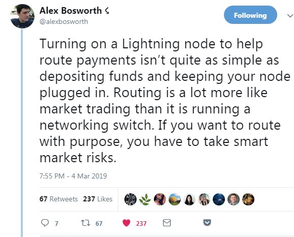

[[Introduzione](README.md)] -- [[Perché avere un nodo Bitcoin](01.Perchè_avere_un_nodo_Bitcoin.md)] -- [[Preparativi](02.Preparativi.md)]  -- [[Configurazione Iniziale da PC](03.Configurazione_iniziale_dell'Hardware.md)] -- [[Preparazione Software Raspberry PI](04.Configurazione_Iniziale_dell'Hardware_RaspberryPI.md )] -- [[Assemblaggio Hardware Nodo](05.Assemblaggio_Hardware_del_nodo.md)] -- [[Configurazione Software Nodo](06.Configurazione_RaspberryPi.md)] -- [[Bitcoin](07.Bitcoin.md)] -- [[Lightning](08.Lightning.md)] -- [[Mainnet](09.Mainnet.md)] -- [[Bonus](10.Bonus.md)]-- [[***FAQ***](099.FAQ.md)] -- [[TO DO](999.2do.md)]
 
-------


# FAQ

### D1) Posso diventare ricco indirizzando pagamenti Lightning?
R1) Non lo sa nessuno. Probabilmente no, le fees sono minime, i nodi più grandi riescono ad incassare circa 50K satoshi al mese con le fees. Troppo poco.


@alexbosworth ha un nodo LN con un commit di 10BTC, ed a gennaio 2019 ha [dichiarato un profitto](https://twitter.com/alexbosworth/status/1084166549307441153) di 1 mBTC (0.001).

Il fatto è significativo in quanto lui stesso ha pubblicato un'interessante guida su come ottimizzare lo status del proprio nodo LN. 

[Alex Bosworth - Lightning channel Management](https://www.youtube.com/watch?v=HlPIB6jt6ww) :gb:

Sempre Alex Bosworth ha scritto un [interessante tweet](https://twitter.com/alexbosworth/status/1102643785748570113) :gb: sostenendo che avere un nodo LN profittevole, ovvero che facia Routing di transazioni, non è equiparabile a girare un interruttore (es: averre un nodo Bitcoin), ma piuttosto al trading, ovvero ad assumersi dei rischi per massimizzare i profitti.



Personalmente credo che mettere su un canale LN sia un bellissimo esperimento, soprattutto se ti piace il tinkering, ma riguardo al ROE, meglio lasciar perdere.
Non so neanche se dovessi essere lieto di essere smentito btw: se le fees su LN dovessero salire, verrebbe meno proprio la funzione di "digital cash per micropagamenti" che al momento LN ambisce a vole assumere. Una delle delle promesse e condizioni per il successo di LN è proprio la risibilità delle fees.
Ritengo che LN sia un’ottima cosa per l’ecosistema bitcoin, per diversi motivi:
* scalabilità transazionale
* digital cash 
* JENGA EFFECT-ogni layer secondario oltre al base layer di blockchain, contribuisce irrobustimento del rbase layer, appunto)


Ma in fondo non ci importa! Siamo qui per divertirci! 

### D2) Posso attaccare l'hard disk formattato con Ext4 al mio PC windows?
R2) Il file system Ext4 non è compatibile con un Windows standard, ma con un software tipo [Linux File Systems](https://www.paragon-software.com/home/linuxfs-windows/#faq) di Paragon Software (è disponibile un periodo di free trial di 10 giorni) è possibile. 

### D3) Come si usano questi comandi Linux?
R3) Questa è una (molto) breve lista deo comandi Linux più usati. Per ciascun comando, potete inserire `man [command]` per avere la relativa pagina del manuale (potete uscire con `q`).

| comando | descrizione | esempio |
| -- | -- | -- |
| `cd` | change to directory | `cd /home/bitcoin` |
| `ls` | list directory content | `ls -la /mnt/hdd` |
| `cp` | copy | `cp file.txt newfile.txt` |
| `mv` | move | `mv file.txt moved_file.txt`
| `rm` | remove | `rm temporaryfile.txt`
| `mkdir` | make directory | `mkdir /home/bitcoin/newdirectory`
| `ln` | make link | `ln -s /target_directory /link`
| `sudo` | run command as superuser | `sudo nano textfile.txt`
| `su` | switch to different user account | `sudo su bitcoin`
| `chown` | change file owner  | `chown bitcoin:bitcoin myfile.txt`
| `chmod` | change file permissions | `chmod +x executable.script`
| `nano` | text file editor | `nano textfile.txt`
| `tar` | archive tool | `tar -cvf archive.tar file1.txt file2.txt`
| `exit` | exit current user session | `exit`
| `systemctl` | control systemd service | `sudo systemctl start bitcoind`
| `journalctl` | query systemd journal | `sudo journalctl -u bitcoind`
| `htop` | monitor processes & resource usage | `htop`
| `shutdown` | shutdown or restart Pi | `sudo shutdown -r now`


In più la linea di comando di Linux ha le seguenti scorciatoie: 

* **Auto completamento dei comandi**: Quando inserite un comando, potete usare il tasto TAB per l'auto completamento, ad esempio per comandi, nome di directories o di files. 

* **Cronologia dei comandi**: con la pressione dei tasti ⬆️ e ⬇️ sulla tastiera, potete scorrere la lista dei comandi inseriti precedentemente, e confermarli dando INVIO.

* **Copia / Incolla**: Se state usando Windows e PuTTY come client SSH, potete copiare il testo dalla interfaccia di comando selezionandolo con il mouse (senza bisogno di alcun click) ed incollarlo nella posizione del cursore con un click del tasto destro ovunque nella finestra di SSH.


### D4) Che risorse online consigli su Bitcoin?

R4) Il numero di risorse è sterminato, ma mi permetto di segnalarne qualcuna, sono tutte in inglese :gb: purtroppo: 

   * :gb: https://bitcoin.org/en/full-node Guida ufficiale di Bitcoin Core su come gestire un nodo Bitcoin Core

   * :gb:  https://www.youtube.com/watch?v=oX0Yrv-6jVs video di Andreas Antonopoulos sul perché è importante avere un nodo Bitcoin.

   * :gb:  https://lopp.net/bitcoin.html Alcune risorse su Bitcoin proposte  da Jameson Loop
   
   * :gb: https://medium.com/@lopp/who-controls-bitcoin-core-c55c0af91b8a  Spiega efficacemente chi scriva il software che viene inserito nei nostri nodi, e di come il software sia sottoposto ad un rigoroso audit per evitare bugs, regressioni, o addirittura attacchi malevoli, il tutto in un'ottica trustless. 
      
 * :gb: [What is Bitcoin?](https://bitcoinmagazine.com/guides/what-bitcoin)
* :gb: [Understanding the Lightning Network](https://bitcoinmagazine.com/articles/understanding-the-lightning-network-part-building-a-bidirectional-payment-channel-1464710791/)
* :gb: Lightning Network resources: [lnroute.com](http://lnroute.com)  


### D5) Che libri  consigli su Bitcoin?

R5) Due sopra tutti: 
* [Mastering Bitcoin](https://github.com/bitcoinbook/bitcoinbook) di Andreas Antonopoulos. Un libro tecnico, che ci permetterà di capire esattamente come funzioni il protocollo bitcoin, padroneggiandone gli elementi più tecnici. 

* [The Bitcoin Standard](https://www.amazon.it/Bitcoin-Standard-Decentralized-Alternative-Central/dp/1119473861) di Saifedean Ammous: un'interessante analisi del bitcoin come moneta: sul perché sia una "buona moneta" secondo i dettami della scuola austriaca. Non ci si addentra negli aspetti tecnici del protocollo, ma in quelli "filosofici" e rilevanti dal punto di vista economico.
   

### D6) Come posso upgradare la versione di Bitcoin Core? 
R6) L'ultima versione del software può essere trovata sulla pagina Github del progetto Bitcoin Core. Assicuratevi di leggere le Release Notes, visto che queste possono contenere informazioni importanti sull'upgrade.  

https://github.com/bitcoin/bitcoin/releases

* Magari prima volete creare un [backup del sistema](raspibolt_65_system-recovery.md).  

* Come utente "admin", arrestate i demoni lnd e bitcoind  
  `$ sudo systemctl stop lnd`  
  `$ sudo systemctl stop bitcoind`  

* Scaricate, verificate, estraete ed installate i binari di Bitcoin Core come descritto nella sezione [Bitcoin](07.Bitcoin.md) della guida.

* Riavviate i demoni di sistema bitcoind e lnd  
  `$ sudo systemctl start bitcoind`  
  `$ sudo systemctl start lnd`
  
### D7) Come aggiorno LND?  
R7) Aggiornare LND non è mai semplice e può portare a molti problemi. Meglio leggere **sempre e per intero** le  [LND release notes](https://github.com/lightningnetwork/lnd/releases/tag/v0.5-beta) per comprendere al meglio i cambiamenti. Quelle note inoltre coprono molti aspetti aggiuntivi e molte nuove funzionalità che qui non tratteremo, ma che sarebbe meglio conoscere.  

* Forse prima è meglio creare un [backup del sistema](raspibolt_65_system-recovery.md).  

* Mentre aggiornate, soprattutto se  **aggiornate a LND 0.5**, vi suggerisco di chiudere i vostri canali prima, visto che ci sono stati parecchi casi di fondi bloccati che hanno richiesto molto lavoro con molte difficoltà per recuperare i fondi.

* Con l'utente "admin" arrestate il demone  
  `$ sudo systemctl stop lnd`

* Se state aggiornando da una versione precedente alla v0.5, cancellate i file macaroon.  
  `$ sudo rm /home/bitcoin/.lnd/*.macaroon`

* Cancellate le cose inutili sull'HD, quindi scaricate, verificate ed installate gli ultimi binari LND.

  ```
  $ cd /home/admin/download
  $  rm -f lnd-linux* manifest* pgp_keys.asc
  $ wget https://github.com/lightningnetwork/lnd/releases/download/v0.6.1-beta/lnd-linux-armv7-v0.6.1-beta.tar.gz
  $ wget https://github.com/lightningnetwork/lnd/releases/download/v0.6.1-beta/manifest-v0.6.1-beta.txt
  $ wget https://github.com/lightningnetwork/lnd/releases/download/v0.6.1-beta/manifest-v0.6.1-beta.txt.sig
  $ wget https://keybase.io/roasbeef/pgp_keys.asc
  
  $ sha256sum --check manifest-v0.6.1-beta.txt --ignore-missing
  > lnd-linux-armv7-v0.6.1-beta.tar.gz: OK
  
  $ gpg ./pgp_keys.asc
  > BD599672C804AF2770869A048B80CD2BB8BD8132
  
  $ gpg --import ./pgp_keys.asc
  $ gpg --verify manifest-v0.6.1-beta.txt.sig
  > gpg: Good signature from "Olaoluwa Osuntokun <laolu32@gmail.com>" [unknown]
  > Primary key fingerprint: BD59 9672 C804 AF27 7086  9A04 8B80 CD2B B8BD 8132
  >      Subkey fingerprint: F803 7E70 C12C 7A26 3C03  2508 CE58 F7F8 E20F D9A2
  
  $ tar -xzf lnd-linux-armv7-v0.6.1-beta.tar.gz
  $ sudo install -m 0755 -o root -g root -t /usr/local/bin lnd-linux-armv7-v0.6.1-beta/*
  $ lnd --version
  > lnd version 0.6.1-beta commit=v0.6.1-beta
  ```

* A partire da questa release, LND si aspetta due differenti *sockets* ZMQ per i blocchi e le transazioni. Editate quindi `bitcoin.conf` di conseguenza, salvate ed uscite.  
  ```
  $ sudo nano /home/bitcoin/.bitcoin/bitcoin.conf  
  zmqpubrawblock=tcp://127.0.0.1:28332
  zmqpubrawtx=tcp://127.0.0.1:28333
  ```
* L'opzione `debughtlc` è stata deprecata, quindi non è più permessa e deve essere cancellata (commentata). Editate il file  `lnd.conf`, salvate ed uscite.  
  ```
  $ sudo nano /home/bitcoin/.lnd/lnd.conf  
  #debughtlc=true
  ```
* Riavviate i servizi con le nuove configurazioni e sbloccate il portafoglio con l'utente "bitcoin". Questo creerà automaticamente un nuovo set di file macaroons (come spiegato sotto).
  ```
  $ sudo systemctl restart bitcoind
  $ sudo systemctl restart lnd
  $ sudo su - bitcoin
  $ lncli unlock
  $ exit
  ```

I file macaroons sono ora salvati sotto la directory dei dati della chain del relativo network.Per esempio, i macaroon dell'utente admin sulla rete di produzione si trovano in:  
  `/home/bitcoin/.lnd/data/chain/bitcoin/mainnet/admin.macaroon`  

* Copiate il nuovo set di macaroons per l'utente  *admin*, altrimenti questo utente non potrà usare la `lncli`. Attenzione: la nuova posizione dei file macaroon deve essere recepita nello [script di auto-unlock](https://github.com/Stadicus/guides/blob/master/raspibolt/raspibolt_6A_auto-unlock.md) che potreste stare usando.  
  * Per la  **mainnet** usate questi comandi:  
    ```
    $ rm /home/admin/.lnd/admin.macaroon
    $ mkdir -p /home/admin/.lnd/data/chain/bitcoin/mainnet/
    $ sudo cp /home/bitcoin/.lnd/data/chain/bitcoin/mainnet/admin.macaroon /home/admin/.lnd/data/chain/bitcoin/mainnet/
    $ sudo cp /home/bitcoin/.lnd/tls.cert /home/admin/.lnd
    $ sudo chown -R admin:admin /home/admin/.lnd
    $ lncli getinfo
    ```
  
  * Se siete su **testnet**, usate gli stessi comandi, ma sostituite la directory "mainnet" con "testnet". Avrete anche bisogno di usare sempre il comando `lncli --network=testnet `, quindi per esempio `lncli --network=testnet getinfo`. Controllate le [release notes](https://github.com/lightningnetwork/lnd/releases) su come creare degli alias per evitare di dover riscrivere ogni volta questi comandi.  

* Non dimenticate di sbloccare i wallet e controllare i log  
  `$ lncli unlock`  
  `$ sudo journalctl -u lnd -f`  

### D8) Perché ho bisogno della versione a 32 bit di Bitcoin se io ho un Raspberry Pi 3 con un processore a 64 bit? 

R8) Al momento (Dec 2018) non è ancora stato sviluppato e sufficientemente testato un sistema operativo a 64 bit per il Raspberry Pi. Il processore a 64 bit del Raspberry 3 quindi gira in modalità compatibilità a 32 bit i sistemi operativi a 32 bit. 


### D9) Questa guida è bellissima, ma non ho tempo e/o capacità. Voglio avere la vita ancora più semplice. Cosa mi consigli? 

R9) Se vuoi avere la pappa pronta, hai le risorse hardware per avere un nodo, ma non il tempo/voglia, allora ti consiglio alcune alternative.

Ho provato ad ordinarle dalla più Plug&Play a quella più "difficile": 

* [Nodo Bitcoin di Casa](https://store.casa/lightning-node/): ancora più semplice: è la prima soluzione Bitcoin Node Plug&Play: basta attaccare la spina ed il cavo di rete (o quasi) per avere un nodo bitcoin e lightning perfettamente funzionante in pochi minuti (la blockchain è già sinconizzzata fino al momento della spedizione). Fondamentalmente è un'installazione ultra customizzata di Bitcoin Core su un Raspberry PI. 

* [Bitseed](https://bitseed.org/): una soluzione per certi versi simile a quella di CASA, ma basata su un Hardware diverso e più potente. Il sistema operativo è UBUNTU, quindi sono disponibili diverse applicazioni, che comunque vengono rette agevolmente dall'hardware. In questa soluzione non è presente la blockchain, che quindi dovrà essere scaricata interamente dall'utente.

* [Node Launcher](https://github.com/PierreRochard/node-launcher): progetto di @pierre_rochard: setup automatico di un nodo Bitcoin+LND avendo a disposzione un PC da dedicarvi. 

* [Raspiblitz](https://github.com/rootzoll/raspiblitz): una guida per certi versi simile a questa, sempre basata su Raspberry, con il vantaggio di avere già il software configurato e pronto all'uso. Il nodo può essere configurato, in pochi click, e può essere up&running in poche ore (per lo più passate ad aspettare che termini il download della blockchain-se ci si accontenta di scaricarla da un file torrent **con i soliti caveat che questa scelta**, facolativa ad ogni modo, **comporta**)

A proposito di Raspiblitz, Riccardo Masutti sta mettendo online alcuni video sull'installazione di un nodo Raspberry basato su Raspiblitz.
Potete trovare il primo video [qui](https://youtu.be/4cDNKfdkllM)


