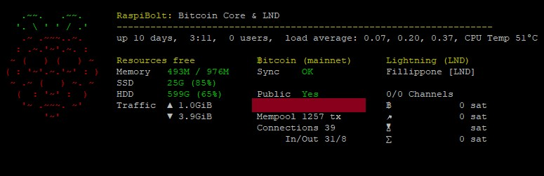

[[Introduzione](README.md)] -- [[Perché avere un nodo Bitcoin](01.Perchè_avere_un_nodo_Bitcoin.md)] -- [[Preparativi](02.Preparativi.md)]  -- 
[[Configurazione Iniziale da PC](03.Configurazione_iniziale_dell'Hardware.md)] -- 
[[Preparazione Software Raspberry PI](04.Configurazione_Iniziale_dell'Hardware_RaspberryPI.md )] -- 
[[Assemblaggio Hardware Nodo](05.Assemblaggio_Hardware_del_nodo.md)] -- 
[[Configurazione Software Nodo](06.Configurazione_RaspberryPi.md)] -- [[Bitcoin](07.Bitcoin.md)] --
[[Lightning](08.Lightning.md)] -- [[Mainnet](09.Mainnet.md)] -- [[***Bonus***](10.Bonus.md)]-- [[FAQ](099.FAQ.md)] -- [[TO DO](999.2do.md)]
 
-------

## Bonus: Overview di Sistema

*Difficoltà: facile*

Per avere una veloce overview dello status di sistema, Stadicus ha creato un piccolo [script per linea di comando](https://github.com/Stadicus/guides/blob/master/raspibolt/resources/20-raspibolt-welcome) 
che viene eseguito come "messaggio del giorno” (Message Of The Day - MotD) per essere mostrato in fase di accesso oppure su richiesta.



Questo script verrà eseguito come root, quindi controllatelo per bene prima di fidarvi dell’autore (Stadicus).

```
$ sudo apt-get install jq net-tools
$ cd /home/admin/download/
$ wget https://raw.githubusercontent.com/Stadicus/guides/master/raspibolt/resources/20-raspibolt-welcome
  
# check script & exit
$ nano 20-raspibolt-welcome

# delete existing welcome scripts and install
$ sudo mv /etc/update-motd.d /etc/update-motd.d.bak
$ sudo mkdir /etc/update-motd.d
$ sudo cp 20-raspibolt-welcome /etc/update-motd.d/
$ sudo chmod +x /etc/update-motd.d/20-raspibolt-welcome
$ sudo ln -s /etc/update-motd.d/20-raspibolt-welcome /usr/local/bin/raspibolt
```

Nel caso in cui ci siano problem sullo script, potrebbe teoricamente impedirvi di accedere al Sistema. Quindi disabiliteremo tutte le esecuzioni del MoTD per l’utente *root*, quindi sarete sempre in grado di loggarvi come utente *root* per disabilitarlo. 
```
$ sudo su 
$ touch /root/.hushlogin
$ exit
```

Potete ora avviare lo script con la stringa  che sarà mostrato ogni volta che vi collegherete oppure potrà essere richiamato con la stringa `sudo raspibolt`.

---
Avanti: [10.Bonus](10.Bonus.md)
