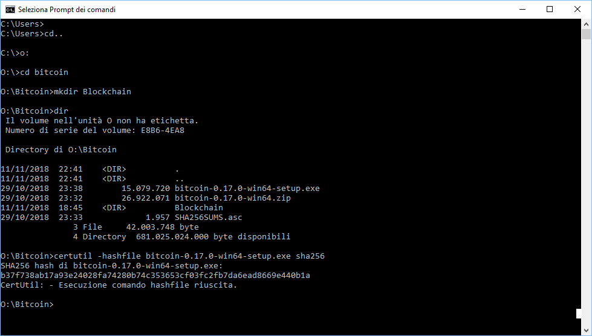

 # Configurazione Iniziale Hardware

La prima cosa da fare sarà quella di assemblare fisicamente il nodo.
Prima ancora però dovremo fare qualche passo preliminare con il PC.

Il menù della sezione quindi è il seguente: 

1. Scaricare la Blockchain sul PC, per poi copiarla sull'HD del Raspberry.
2. Scaricare il sistema operativo del Raspberry sul PC e copiarlo sulla MicroSD
3. Finalmente Assemblare l'Hardware del nodo.


## 1. Scaricare la blockchain di Bitcoin

La Blockchain di bitcoin registra tutte le transazioni e definisce in pratica a chi appartengano quanti bitcoin. Questo database è il punto critico di avere un nodo bitcoin, e quindi dobbiamo porre su di esso molta attenzione. É fondamentale quindi scaricare la blockchain in modo sicuro: l'unico modo di farlo è tramite il software di Bitcoin sul PC, installandolo e poi e lasciandolo sincronizzare. Sarà sicuramente un processo lungo, ma solo in questo modo saremo sicuri che la blockchain scaricata sia quella effettivamente associata alla catena di proof of work più lunga, e quindi quella valida per bitcoin.

Potremmo scaricare la blockchain da torrent o da molti siti, e poi lasciarla analizzare dal nodo. Il rischio sarebbe minimo, o quasi nullo, visto che anche una singola transazione non valida muterebbe irrimediabilmente la validitàà della blockchain. Ma davvero siamo così pigri? 

Una volta scaricata l'intera blcockchain (a novembre 2018 circa 220 GB)  il nostro nodo quindi sarà quindi in grado di 

1. verify every Bitcoin transaction that ever occurred and every block ever mined,
2.create an index database for all transactions, so that we can query it later on,
3. calculate all bitcoin address balances (called the UTXO set).

:point_right: Consultate  [Running a Full Node](https://bitcoin.org/en/full-node) per avere maggiori informazioni su come gestire un nodo bitcoin. 

### Accendiamo il PC 

La validazione della Blockchain, più che il download stesso, è un processo ad intenso uso di CPU, disco e di RAM che può impiegare giorni. Per questo vogliamo farlo su un PC che ha caratteristiche Hardware molto migliori del Raspberry, e sopratutto vogliamo iniziare subito: possono essere necessari diversi giorni, a seconda delle caratteristiche hardware del PC (connessione inclusa, naturalmente). Se al contrario provassimo ad usare un Raspberry probabilmente potrebbero volerci settimane o mesi viste le limitazioni di CPU e soprattuto RAM.  
L'obiettivo di questa prima parte è quindi quello di scaricare e verificare la blockchain installando Bitcoin Core su un PC e quindi trasferire i dati sul Raspberry. Questo sarà necessario solo all'inizio. Una volta inizializzata la blockchain il Pi potrà facilmente stare dietro all'aggiornamento dei singoli blocchi. 


In questa guida ipotizzeremo di usare un PC Windows, ma il funzionamento è il medesimo per la maggior parte dei sistemi operativi. Avrete bisogno di circa 300GB di spazio su disco, o interno o esterno (ma non quello che useremo per il Raspberry). Poichè la creazione dell' indice crea un elevato traffico di lettura/scrittura, più rapido è l'Hard disk, meglio è. Un disco rigido interno o esterno USB3 saranno significativamente più rapidi di un disco con una connessione USB2.

Per copiare la blockchain sul Raspberry Pi abbiamo diverse opzioni
* **Migliore**: la modalità migliore è quella di formattare il disco esterno del Raspberry Pi con il file system Ext4, che è il migliore per il nostro caso. Potremo poi copiare la blockchain dal PC attraverso la rete locale usando un programmino chiamato SPC.


* **Recommended**: The best configuration is to format the external hard disk of the Pi with the Ext4 file system, which is better suited for our use case. Using SPC, we then copy the blockchain from the Windows computer over the local network.

* **Oppure**, se volete usare un Hard Disk esterno per il vostro Easberry che già contiene dati, mi auguro perchè avete già scaricato la blockchain sul disco, si può fare lo stesso. Si potrà usare il disco così come è, saltando la parte della guida relativa alla formattazione del disco.

### Download e verifica di Bitcoin Core
Scaricatte il Bitcoin Core installer da [bitcoincore.org/en/download](https://bitcoincore.org/en/download) e salvatelo nella directory che vorrete usare per salvare la Blockchain. Per garantirci che stiamo usando il programma originale dovremo calcolare l'hash del file scaricato e verificare che corrisponda all'hash segnalato sul sito. Solo in uqesto modo saremo sicuri di scaricare un programma inalterato rispetto al codice originale. 

Nella guida, quando inserirò dei comandi da inserire in Windows, saranno sempre preceduti dal simbolo `>`, quindi il comando `> cd bitcoin` dovrà essere inserito semplicemente come `cd bitcoin` più Invio.


Aprite il prompt dei comandi di Windows (`Win+R`, scrivete `cmd`, premete `Invio`, oppure più semplicemente cercate "cmd" nella barra di ricerca di Windows10 e selezionate "PRompt dei comandi" tra i risultati), navigate fino alla directory bitcoin (ad esempio nel drive `O:`. Il minimo necessario che vi servirà sarà il comando `>cd` + directory per scendere in una sottodirectory rispetto a dove vi trovate, oppure `>cd..` per risalire di uno step rispetto a dove vi trovate, per cambiare drive sarà sufficinete digitare la lettera ad esso associato) e create quindi una nuova directory `Blockchain`. 

A questo punto siamo pronti per calcolare l'hash del file che abbiamo appena scaricato
```
> O:
> cd \Bitcoin
> mkdir Blockchain
> dir
> certutil -hashfile bitcoin-0.17.0-win64-setup.exe sha256

```


Dobbiamo assicurarci che questo hash sia identico al valore indicato nelle release signatures della versione corrispondente: possiamo trovare il file .asc (Armoured ASCII file) che contiene utti gli hash all'indirizzo:  [release signatures](https://bitcoin.org/bin/bitcoin-core-0.17.0/SHA256SUMS.asc). Nel nostro caso, abbiamo scaricato il file eseguibile per Windows, e quindi i checksum dei file bitcoin-0.17.0-winXX-setup.exe sono:
```
32 bit:  1f4091f6f32685aac3f790edae8657abe0c96448720b165762399a31499f8ee7 
64 bit:  b37f738ab17a93e24028fa74280b74c353653cf03fc2fb7da6ead8669e440b1a
```
Dobbiamo controllare che corrisponano TUTTE le cifre dell'hash, è importante, ci vogliono pichi minuti, fatelo. 
In realtà poi dovremo essere sicuri che stiamo leggendo il file .asc giusto, e non uno corrotto (da un attacco man in the middle, per esempio). Dobbiamo quindi anche verificare la firma del file stesso ("dont'trust, verify", ricordate?). Per comodità lo faremo successivamente sul Raspberry, in quanto è molto più semplice farlo in UNIX che in Windows. 


### Installiamo Bitcoin Core

Eseguite il file di installazione di Bitcoin Core (potreste avere bisogno di avere i privilegi di amministratore: selezionate il file con il tasto destro e selezionate "Esegui come amministratore") ed installatelo usando i setting di default. 

Avvitate il programma  `bitcoin-qt.exe` nella directory "O:\Bitcoin". Scegliete la nuova directory appena creata “Blockchain” come directory di Dati personalizzata.


:warning: **IMPORTANTE: Il prossimo step è fondamentale. Senza il comando `txindex=1` la vostra Bitcoin blockchain sarà inutile** :warning:  

Bitcoin Core inizierà immediatamente a sincronizzare la blockchain , ma dovremo inserire un settaggio nel file “bitcoin.conf” in modo che il software scarichi l'intera blockchain e non solo le transazioni effettivamente usate dal nostro wallet. Dal menù di Bitcoin Core quindi selzionate `Settaggi` / `Opzioni` e selzionate il pulsante `Apri il file di configurazione`. Inserite la seguente riga di comando:
```
txindex=1
```
Se il vostro computer ha molta memoria, inoltre potete aumentare la dimensione del database tenuto nella memoria cache aggiungendo la seguente riga di comando(specificando l'ammontare in megabytes di memoria da usare, a seconda della configurazione del vostro PC):

```
dbcache=6000
```

Salvate e chiudete il file di testo, uscite da Bitcoin Core usando `File` / `Exit` e riavviate il programma. Il programma riniizierà autonomammente a sincronizzarsi scaricando la blockchain.and restart the program. 
Lasciamolo lavorare in pace: saranno necessari diversi giorni perchè il download della blockchain sia completato. 


##3.Assemblare l'Hardware del nodo. ##
Il setup sotto riportato è quello che minimizza l’hardware richiesto assicurando un funzionamento corretto e stabile.


Per prima cosa dovremo assemblare il Raspberry. Non dovrebbe essere un problema attaccare i dissipatori ai chip seguendo le immagini dimostrative, avvitare la scheda madre al case usando le apposite viti con il cacciavite in dotazione e per ultimo chiudere il case e montare i piedini di gomma. Come vedete vi è una lunga apertura del case in corrispondenza della porta  GPIO (General Purpose Input/Output port, quella lunga con tutti quei pin, insomma) del Raspberry: visto che non sarà utile nel nostro caso, si può pensare di chiuderla con del nastro adesivo, uno sticker o qualche altra decorazione: il raffreddamento del case non ne soffrirà, ed in compenso limiteremo l’accesso alla polvere: quella è sicuramente dannosa.


A questo punto potremo inserire la scheda Micro SD nello slot del Raspberry. (MA QUANDO CI HO COPIATO IL ISTEMA OPERATIVO DENTRO?)


Colleghiamo alla presa micro usb di alimentazione del Raspberry uno dei due cavi di alimentazioni dell’alimentatore. L’altro invece andrà ad alimentare l’HUB, che a sua volta collegheremo ad una delle 4 prese USB del Raspberry stesso. A questo punto sia il Raspberry che l’HUB sono correttamente alimentati e collegati, possiamo quindi collegare l’Hard Disk all’HUB: sarà quindi solo l’HUB ad alimentare l’Hard disk, che pertanto non andrà a sottrarre amperaggio al funzionamento del Raspberry.
Credo che sia stato tutto abbastanza facile, alla fine dovremmo avere ottenuto un setup simile al seguente: 


###### Figura 3. That was easy #######
